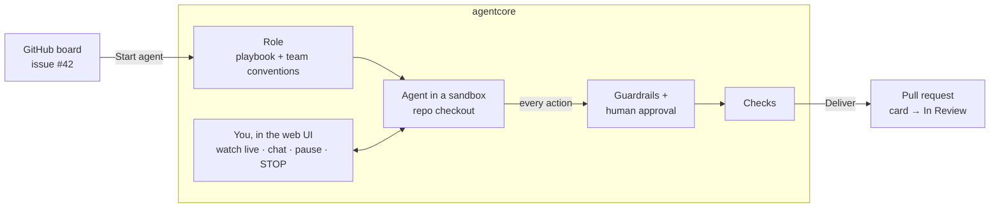

# agentcore

Secure runtime layer for AI agents: sandboxed tools, policy-based permissions,
human approval, and audit logs. Written in Rust, works with any MCP agent.

agentcore lets a team run AI agents (opencode today, any CLI or MCP agent
tomorrow) as **supervised coworkers inside the team's normal workflow**: they
pick up GitHub issues from the board, work in an isolated sandbox on a checkout
of the repository, follow the team's own conventions, talk with their
supervisor, and deliver pull requests that move the card to review. Every side
effect goes through a policy people wrote, risky steps wait for a human,
everything is visible live in a web UI, one click stops it, and an append-only,
tamper-evident log records what happened.



## Features

| Requirement | How agentcore covers it |
|---|---|
| Run open code securely | Per-session container: `--cap-drop=ALL`, `no-new-privileges`, read-only root fs, non-root user, pid/memory/cpu limits, `--network=none` or an internal-only network, optional gVisor/Kata runtime. |
| Coworker for the team | Projects link a GitHub repository and its Projects board (kanban, sprints). Start an agent on a card: it gets a sandboxed checkout, the issue with its discussion, and role-specific GitHub tools (issues, milestones, board, discussions). |
| Ways of working | **Roles** (developer, project manager, marketing, or your own) define how the agent works: playbook, the team's own convention files from the repository, tools, board transitions, and **checks** that must pass before work leaves the sandbox. See [docs/WAYS_OF_WORKING.md](docs/WAYS_OF_WORKING.md). |
| Conversation | Agents wait after each turn; send follow-ups ("also add tests") and they continue in the same workspace and conversation. |
| Review & delivery | *Changes* tab with commits and diff. *Deliver* runs the checks, pushes the agent's branch with agentcore's credentials, opens/updates the PR (issue link, AI disclosure) and moves the card to *In review*. |
| Hostable | Single binary + static UI, PostgreSQL, Docker image, docker-compose with an isolated sandbox network, token auth with admin/operator/viewer roles. |
| Model gateway | Agents call LLMs through agentcore with a per-session token. Real API keys are stored AES-256-GCM encrypted in PostgreSQL and never enter a sandbox; per-provider model allow-lists and per-session call limits apply. Every call is logged with token usage and full request/response. **Stop** aborts calls that are still streaming. Providers are managed in the web UI. |
| See what the agent does | **Live view**, like a screen share: the agent's own terminal, the command it is running with its output, the model's reasoning, text and tool calls as they stream, the files it changes and the processes in its sandbox. Finished sessions can be **replayed** from a tamper-evident terminal recording. Plus a timeline of every action, policy verdict, approval and outcome. |
| One-click stop, pause | **STOP AGENT** per session and **Stop all agents** globally: kills the sandbox, denies pending approvals, and records who pressed it. Also enforced by time and action budgets. **Pause** freezes the agent and everything it runs, **Resume** continues exactly where it was. |
| Multi-agent organisations | **Departments** (rooms) of agents with their own mission, tools, data and policy. Agents talk freely inside a department; departments talk only through their **communicator** agents. Watch every message, talk to any agent, pause or stop an agent, a department or everything. Admin-set limits on departments and agents. Runs on one or several VMs sharing PostgreSQL. **Templates** for 29 business functions and growth paths let you start with one software department and grow step by step, or create a complete company at once; the organisation then suggests what to add next. **Goals** and scheduled **check-ins** keep it working over days: idle agents sleep, check-ins and messages wake them, and agents that run out of time continue in a fresh session from their notes. Departments can work on a linked GitHub repository and read granted **business data** (tables, PostgreSQL, HTTP APIs; read-only). A **dashboard** shows how the organisation is doing and what looks inefficient; a **Retrospective** agent proposes improvements with evidence that people apply, change, send back or reject. See [docs/MULTI_AGENT.md](docs/MULTI_AGENT.md). |
| Any agent | **Agent catalogue**: add popular open-source agents (opencode, Codex CLI, Qwen Code, goose, fast-agent, Aider, mini-SWE-agent; MIT/Apache-2.0 only) from the web UI with a provider and a model; agentcore wires each one to its model gateway and, where the agent supports it, its policy-checked tools. See [docs/AGENT_CATALOG.md](docs/AGENT_CATALOG.md). Your own agents: the `command` adapter (any CLI) or an `AgentAdapter`. |
| User policies | TOML policies with allow / deny / require-approval rules over commands, paths, hosts and tools; deny-overrides semantics; limits. |
| HITL | Approve or reject with a comment from the UI; timeouts count as rejection. |
| Logging & tracing | Hash-chained JSONL audit log per session (fail-closed), including every model call with request/response hashes; full LLM traffic and configuration changes in PostgreSQL; structured `tracing` logs (JSON); integrity check and export from the UI/CLI. |
| EU AI Act | See [docs/EU_AI_ACT.md](docs/EU_AI_ACT.md) for the article-by-article mapping. |

## Quick start (local development)

Requires Rust ≥ 1.94, Node ≥ 20 and PostgreSQL (≥ 14).

```sh
docker compose up -d postgres                 # or point [database].url at your own
(cd web && npm ci && npm run build)
cargo run -p agentcore-cli -- serve --config agentcore.dev.toml
# open http://127.0.0.1:8080 and start the "demo" agent
```

Migrations run automatically at startup. On first start agentcore generates
`data/master.key`, which encrypts model API keys in the database. Back it up.

`agentcore.dev.toml` uses the `process` backend, which runs agents **directly on
your machine without isolation**. Use it only to develop agentcore itself.

For UI development with hot reload, run the server as above and `npm run dev`
in `web/` (Vite proxies `/api` to `127.0.0.1:8080`).

## Self-hosting

```sh
docker build -t agentcore-sandbox:latest sandbox-image   # image agents run in
cp deploy/agentcore.toml.example deploy/agentcore.toml
docker compose run --rm agentcore hash-token 'a-long-random-token'
# put the hash into [[server.operators]] (role = "admin") in deploy/agentcore.toml
export AGENTCORE_DATA=/srv/agentcore/data POSTGRES_PASSWORD=$(openssl rand -hex 16)
docker compose up -d
# open http://<host>:8080 → Settings → add your model provider (API key)
```

Everything after that happens in the web UI: provider keys, starting agents,
approvals, stopping, audit.

Put a TLS-terminating reverse proxy in front of port 8080. Read
[SECURITY.md](SECURITY.md) before exposing it; in particular, the Docker
socket gives agentcore root-equivalent access to its host.

## Working with GitHub

1. **Settings → GitHub** (admin): paste a token (a bot account or fine-grained
   token with contents, issues, pull requests, projects and discussions access
   to the repositories you link). It is stored encrypted; agents never see it.
2. **Projects → New project** (admin): repository, base branch, agent, default
   role, optionally the GitHub Projects board (owner + number, status column
   names, sprint field), and notes for agents.
3. On the project's board, **Start agent** on a card, pick a role, add
   instructions if needed. Follow the conversation, answer, review the
   *Changes*, then **Deliver**.

## Running opencode

The `opencode` agent is defined in `agentcore.example.toml` and
`deploy/agentcore.toml.example`. agentcore launches `opencode run "<task>"`
inside the sandbox. It turns off opencode's own file, shell and web tools and
registers the agentcore MCP gateway, so every read, write and command goes
through your policy.

1. Make `opencode` available where the agent runs: the sandbox image installs it
   (`docker build -t agentcore-sandbox:latest sandbox-image`). With the dev
   `process` backend, install it on your machine (`npm i -g opencode-ai`).
2. In the web UI, open **Settings** and add a model provider. Only admins can
   do this. Either:
   - **Anthropic** / **OpenAI** with your API key; or
   - **OpenCode Zen** (name `opencode`) with a Zen API key from
     [opencode.ai/zen](https://opencode.ai/zen). Zen's keyless free tier only
     accepts requests coming directly from the opencode app, so it does not
     work through agentcore's gateway.
3. Go back to **Sessions**, pick **opencode**, choose a policy, describe the
   task and click **Start agent**.

opencode's `anthropic`, `openai` and `opencode` (Zen) providers are pointed at the model gateway,
so it works on the internal-only sandbox network: the sandbox needs no
internet access. Each LLM call shows up in the session's activity timeline
with tokens, timing and the full request and response.

With OpenCode Zen, opencode only offers Zen's free models (Big Pickle is the
default; force it with `args = ["run", "--model", "opencode/big-pickle", "{task}"]`),
billed through your Zen key. Paid Zen models are not offered to opencode.

## CLI

```sh
agentcore serve --config agentcore.toml
agentcore policy check policies/
agentcore policy eval default '{"type":"exec","command":"git","args":["push"]}'
agentcore audit verify data/audit/*.jsonl
agentcore audit show data/audit/<session>.jsonl
agentcore hash-token '<token>'
```

## Repository layout

| Path | What |
|---|---|
| `crates/agentcore-core` | Domain types: actions, events, sessions, the `AgentAdapter` trait |
| `crates/agentcore-policy` | Policy language and engine |
| `crates/agentcore-audit` | Hash-chained audit log |
| `crates/agentcore-sandbox` | `Sandbox` trait; Docker and (dev-only) process backends |
| `crates/agentcore-runtime` | Session supervisor, approvals, kill switch, adapters |
| `crates/agentcore-roles` | Roles (playbooks): instructions, team conventions, tools, workflow, checks |
| `crates/agentcore-store` | PostgreSQL: sessions, model providers, GitHub connection (encrypted secrets), projects, model calls, changes, admin log, organisations (departments, agents, messages, files, goals, check-ins, data sources, activity, proposals), node registry |
| `crates/agentcore-server` | REST/SSE API, MCP tool gateway, model gateway, auth, config, UI hosting, organisations and templates, cluster (nodes, reconciler, forwarding) |
| `crates/agentcore-cli` | The `agentcore` binary |
| `web/` | React + TypeScript web UI (Vite) |
| `policies/` | Guardrail policies: `default`, `read-only`, `supervised`, `project-management`, `marketing`, `department`, `communicator` |
| `roles/` | Roles: `developer`, `project-manager`, `marketing` |
| `templates/` | Department templates (`departments/`), growth paths (`blueprints/`) and the agent catalogue (`agents/`) |
| `sandbox-image/` | The image agents run in, and `install-agents.sh` to add catalogue agents |
| `docs/` | Architecture, policies, EU AI Act mapping |

## Documentation

- [Architecture](docs/ARCHITECTURE.md): components, session lifecycle, the life of an action, the live view and pausing, gateways, repository and delivery, data model, adding agents and sandbox backends.
- [Multi-agent organisations](docs/MULTI_AGENT.md): departments, communicators, building from templates and growing, goals and check-ins, business data, metrics and the retrospective, who may talk to whom, oversight, limits, and running on several VMs.
- [Agent catalogue](docs/AGENT_CATALOG.md): the open-source agents you can add, how they are connected and guarded, their licenses, and how to add your own.
- [Ways of working](docs/WAYS_OF_WORKING.md): guardrails vs. roles vs. checks, writing your own roles, how agents fit sprints and kanban.
- [Deployment](docs/DEPLOYMENT.md): topology, install, several VMs, macOS notes, operations.
- [Configuration](docs/CONFIGURATION.md): every setting and environment variable.
- [API](docs/API.md): operator API, live event stream, tool and model gateways.
- [Policies](docs/POLICIES.md): guardrail policy language reference.
- [EU AI Act](docs/EU_AI_ACT.md): how agentcore supports the obligations for providers and deployers.
- [Security](SECURITY.md): threat model and hardening.

## Testing

```sh
export AGENTCORE_TEST_DATABASE_URL=postgres://postgres@localhost/postgres  # superuser; tests create throwaway databases
cargo test                       # unit + integration tests (process backend, mock LLM upstream)
cargo test -p agentcore-sandbox --test docker -- --ignored   # needs a Docker daemon
(cd web && npm run build)        # type-checks the UI
```

Without `AGENTCORE_TEST_DATABASE_URL`, the PostgreSQL tests are skipped.

## License

Apache-2.0
