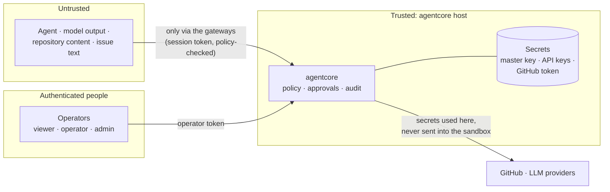

# Security

## Threat model

agentcore assumes the **agent is untrusted**. Its model can be wrong, and it can
be manipulated by content it reads (prompt injection via issues, code, web pages).

Trust boundaries:

1. **Sandbox (hard boundary).** Contains everything the agent process does,
   including actions that never touch the gateway.
2. **Gateway policy (fine-grained boundary).** Governs what the agent may do
   through agentcore tools, and adds human approval and audit.
3. **Operator API.** Only authenticated humans can start, approve or stop.
4. **Departments** (multi-agent organisations). A worker can only message its
   own department and use its own department's files; the department is
   taken from the agent's identity, never from tool arguments. Other
   departments are reached only through communicators, which have no tools
   but messaging. This limits what a manipulated agent can reach directly;
   it does not stop a communicator from *relaying* text it was given, so
   treat messages between departments as untrusted input and use approvals
   (`team_send_to_department`) where information must not leave a department.

Prompt injection (malicious text in an issue, a file or a web page) is
expected: it can change what the agent *tries*, not what it is *allowed* to
do, and every attempt is recorded.

## Defaults

* Containers: `--cap-drop=ALL`, `--security-opt=no-new-privileges`,
  `--read-only` root with small `tmpfs` mounts, `--user 1000:1000`,
  `--pids-limit`, memory and CPU limits, `--init`, `--network=none`.
* Only `/workspace` is writable and shared with the host.
* File paths are normalised before policy evaluation; the process backend
  additionally resolves symlinks and refuses paths that leave the workspace.
  The Docker backend performs file operations inside the container.
* Each session gets a random gateway token; the gateway answers 401 for both
  unknown sessions and wrong tokens.
* Operator tokens are stored only as SHA-256 hashes and compared in constant time.
* Without operators configured, the server refuses to bind to a non-loopback address.
* Audit logging is fail-closed: if an event cannot be recorded, the session is stopped.
* Model API keys never enter a sandbox. They are stored AES-256-GCM encrypted
  in PostgreSQL (with the provider name bound as associated data) and added by
  the model gateway on the way out. Agents only hold a session token that stops
  working when the session ends.
* Only the `admin` role can add, rotate or delete provider keys; keys are never
  returned by the API, and every change is logged with its actor.
* The GitHub token is encrypted at rest like provider keys. Agents use GitHub
  only through agentcore tools bound to the project's repository and board,
  limited by the role's capabilities and checked by the guardrail policy.
* Git: the token is passed to git as an HTTP header through environment
  variables (never on the command line or in a config file); hooks, fsmonitor
  and credential helpers are disabled for every git command agentcore runs.
  Work leaves the sandbox only as a git bundle (data), fetched into a bare
  mirror the agent never touches, and only the session's branch is pushed,
  after the role's checks pass and a human clicks *Deliver*.
* Secrets passed to agents (`{env:NAME}`) go into the environment, which is
  never audited, and never into the audited command line.
* Watching is read-only: the live view and recordings never send input to the
  agent's terminal. Viewers can watch; pausing, resuming and stopping need the
  `operator` role and are audited with who did it.

## Hardening checklist

- [ ] Use gVisor (`runtime = "runsc"`) or Kata Containers for untrusted agents.
- [ ] Run agentcore on a dedicated VM. **Access to the Docker socket is root-equivalent.** Prefer rootless Docker or Podman.
- [ ] Terminate TLS in front of agentcore; never expose port 8080 directly.
- [ ] Use long random operator tokens; give most people the `viewer` role.
- [ ] Keep sandboxes on `network = "none"` or an `internal` network. With the
      model gateway they need no egress at all.
- [ ] Back up the master key (`data/master.key` or `$AGENTCORE_MASTER_KEY`)
      separately from the database backups. Losing it makes stored provider
      keys unrecoverable; leaking it together with a DB dump exposes them.
- [ ] Use provider API keys with spending limits, and set `allowed_models`.
- [ ] Use a dedicated PostgreSQL role and TLS (`?sslmode=require`) for remote databases.
- [ ] Restrict access to the `model_calls` table: it contains prompts and responses.
- [ ] Use a dedicated bot account or fine-grained token for GitHub with access
      only to the repositories and boards agents work on; protect `main` with
      branch protection and required reviews so agent PRs need human approval.
- [ ] Store `data/` on an encrypted volume with backups; restrict who can read audit logs and terminal recordings (`data/recordings`): they contain whatever the agent printed.
- [ ] Never use the `process` backend outside local development.
- [ ] Several VMs: keep `internal_url` on a private network, use TLS and a
      dedicated role for PostgreSQL (anyone who can write to it can direct
      agents), and give every node the same master key and operator list.
- [ ] Set organisation limits (departments, agents per department) and each
      node's `max_agents` to what you can supervise and pay for.

## Known limitations

* The `process` backend provides **no isolation**.
* Docker file writes and reads run inside the container, which is safe against
  host symlink tricks. Policies match the requested path, not a symlink's
  target inside the container.
* Agents with native tools that bypass the gateway are only constrained by the
  sandbox, not by policy.
* Node-to-node requests are plain HTTP to `internal_url` unless you put TLS in
  front of it; they carry the operator's token.
* Communicators are language models: they can be persuaded to pass on
  information. The department boundary controls tools and data access, not
  what text crosses it.

## Reporting vulnerabilities

Please report vulnerabilities privately via GitHub security advisories on this repository.
