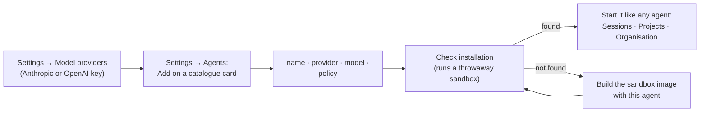
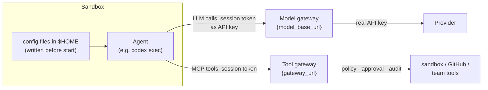

# Agent catalogue

agentcore can run popular open-source agents as well as your own. The
catalogue lists agents that have been verified to work inside agentcore: an
admin adds one in the web UI (**Settings → Agents**), picks the model
provider and model it uses, and it is available everywhere agents are
started (sessions, projects, departments).

- [The agents](#the-agents)
- [Adding an agent](#adding-an-agent)
- [How agents are connected](#how-agents-are-connected)
- [Guardrail levels](#guardrail-levels)
- [Licenses and legal notes](#licenses-and-legal-notes)
- [Agents that are not in the catalogue](#agents-that-are-not-in-the-catalogue)
- [How the integrations were verified](#how-the-integrations-were-verified)
- [Writing a catalogue entry](#writing-a-catalogue-entry)

## The agents

| Agent | What it is for | License | Model protocols | Guardrails | Conversation |
|---|---|---|---|---|---|
| **opencode** (SST / Anomaly) | Coding agent, any provider | MIT | Anthropic, OpenAI | Full | yes |
| **Codex CLI** (OpenAI) | Coding agent | Apache-2.0 | OpenAI | Full | yes |
| **Qwen Code** (Qwen / Alibaba) | Coding agent, any OpenAI-compatible model | Apache-2.0 | OpenAI | Full | yes |
| **goose** (Agentic AI Foundation, originally Block) | General purpose: research, writing, planning, coding | Apache-2.0 | Anthropic, OpenAI | Full | yes |
| **fast-agent** | Lightweight MCP-native assistant for any department | Apache-2.0 | Anthropic, OpenAI | Full | yes |
| **Aider** | AI pair programmer that edits and commits | Apache-2.0 | Anthropic, OpenAI | Sandbox only | yes |
| **mini-SWE-agent** (SWE-agent team) | Minimal bash-only agent for software tasks | MIT | Anthropic, OpenAI | Sandbox only | single run |

* *Model protocols*: which kind of provider (Settings → Model providers) the
  agent can use. "OpenAI" includes OpenAI-compatible servers.
* *Conversation*: the agent continues the same conversation when a person
  (or, in a department, a colleague) sends a message. Single-run agents end
  after one task.
* goose and fast-agent have no built-in tools of their own here, so they suit
  business departments (marketing, finance, operations, ...): with the
  department's team tools they read and write department files and talk to
  colleagues.

## Adding an agent



1. Add a model provider of the right kind (the dialog only offers matching
   ones). Model allow-lists of the provider are respected.
2. **Add** the agent: a name, the provider, the model (suggestions are
   offered) and optionally a guardrail policy.
3. **Check installation** starts a throwaway sandbox and looks for the
   agent's program in it. The default sandbox image only contains opencode;
   build an image with more agents:

   ```sh
   docker build --build-arg AGENTS="codex goose" -t agentcore-sandbox:latest sandbox-image
   docker build --build-arg AGENTS=all -t agentcore-sandbox:latest sandbox-image
   ```

   The image installs each agent from its official channel (npm, PyPI or the
   project's GitHub releases) at the version the integration was verified
   with (`sandbox-image/install-agents.sh`). An agent can also use its own
   image (Advanced → sandbox image).

Added agents are stored in PostgreSQL and loaded by every node (on a change,
all nodes reload them). Changing the model or provider later re-creates the
agent from the current catalogue entry; running sessions are not affected.
Agents from `[[agents]]` in the configuration file still work and win over an
added agent of the same name.

API: `GET /api/v1/agents/catalog`, `GET`/`POST /api/v1/agents`,
`PUT`/`DELETE /api/v1/agents/{name}`, `POST /api/v1/agents/{name}/check`
(see [API](API.md)).

## How agents are connected

Every catalogue entry is a launch recipe: the program, its arguments, its
environment and the configuration files it needs, with placeholders that
agentcore fills in for each session.



* **Models.** The agent is configured with the model gateway's URL for the
  chosen provider and the session token as its "API key". The real key stays
  in agentcore; every call is logged with tokens, request and response.
* **Tools.** Agents that support MCP get agentcore's tool gateway (and, in a
  department, the team tools). For agents with full guardrails, their own
  shell, file, web and sub-agent tools are switched off in the recipe.
* **Secrets.** The session token can only be placed in environment
  variables and files (`{gateway_token}`), never in arguments, because
  arguments are recorded in the audit log. agentcore refuses entries that try.
* **Telemetry and updates** are switched off where the agent offers a
  setting (Codex update checks, goose and Qwen telemetry, Aider analytics,
  LiteLLM's price list download). Sandboxes have no internet access anyway.

What each agent gets:

| Agent | Launch | Model connection | Tools |
|---|---|---|---|
| opencode | `opencode run` (built-in adapter) | inline config, provider base URL + token | MCP; all native tools denied |
| Codex CLI | `codex exec` / `codex exec resume --last` | `~/.codex/config.toml`: custom provider (Responses API) | MCP with bearer token; shell, sub-agents, image viewer, hosted web search disabled |
| Qwen Code | `qwen` headless / `--continue` | `OPENAI_BASE_URL`, `OPENAI_API_KEY` | `~/.qwen/settings.json`: MCP; native file, shell, web, memory and sub-agent tools excluded |
| goose | `goose run --name agentcore` / `--resume` | `GOOSE_PROVIDER`, `ANTHROPIC_HOST`/`OPENAI_HOST` | `~/.config/goose/config.yaml`: MCP extension; every built-in extension disabled |
| fast-agent | `fast-agent go` / `--resume` | `~/.fast-agent/fast-agent.yaml` | MCP (no built-in tools) |
| Aider | `aider --message` / `--restore-chat-history` | LiteLLM via `OPENAI_API_BASE` / `ANTHROPIC_API_BASE` | its own file editing and git |
| mini-SWE-agent | `mini --yolo --exit-immediately` | LiteLLM, as Aider | its own bash |

## Guardrail levels

| Level | Meaning | Agents |
|---|---|---|
| **Full** | The agent has no side-effecting tools of its own: every command, file change and team action is a gateway tool call, checked against the policy, approved by a person where required, and audited. | opencode, Codex CLI, Qwen Code, goose, fast-agent |
| **Sandbox only** | The agent edits files and runs commands with its own tools inside the sandbox. The policy does not see these individual actions. Still in force: the sandbox (no network, resource limits, non-root, read-only system), the model gateway (keys, limits, logging), the live terminal and its recording, pause and stop. | Aider, mini-SWE-agent |

Use sandbox-only agents where the sandbox boundary is enough (work in a
checkout that a person reviews before delivery); use agents with full
guardrails where individual actions need policy and approval.

## Licenses and legal notes

The catalogue only accepts agents under permissive open-source licenses
(`MIT`, `Apache-2.0`, `BSD-2-Clause`, `BSD-3-Clause`, `ISC`, `0BSD`);
agentcore refuses to load an entry with any other license. These licenses
allow use, including commercial use, modification and redistribution,
without copyleft obligations.

| Agent | License | Verified from |
|---|---|---|
| opencode | MIT | `LICENSE` in the npm package `opencode-ai` 1.18.35 |
| Codex CLI | Apache-2.0 | npm package metadata of `@openai/codex` 0.161.0; `LICENSE` in the repository |
| Qwen Code | Apache-2.0 | `LICENSE` in the npm package `@qwen-code/qwen-code` 0.25.0 |
| goose | Apache-2.0 | `LICENSE` in the repository at tag `v1.53.0` |
| fast-agent | Apache-2.0 | PyPI metadata of `fast-agent-mcp` 0.10.43; `LICENSE` in the repository |
| Aider | Apache-2.0 | PyPI metadata of `aider-chat` 0.86.2; `LICENSE.txt` in the repository |
| mini-SWE-agent | MIT | PyPI metadata of `mini-swe-agent` 2.4.6; `LICENSE.md` in the repository |

How agentcore uses them, and what that means:

* **agentcore does not contain, modify or redistribute these agents.** The
  catalogue holds launch recipes (command line, configuration). The agents
  are installed from their official packages when *you* build a sandbox
  image.
* **If you distribute such an image** (push it to a registry others use,
  ship it to customers), you redistribute the agents. The licenses then
  require keeping their license texts and, for Apache-2.0 software, any
  `NOTICE` files. The packages carry them (npm and PyPI packages include
  their license files); the install script adds goose's license, which its
  release binary does not include, under `/usr/share/doc/agentcore-agents/`.
* **Trademarks.** The licenses do not grant trademark rights (Apache-2.0
  §6). agentcore uses the agents' names only to identify them; do not
  present your product as endorsed by their authors.
* **Models are separate.** These licenses cover the agent software. Using a
  model is governed by your agreement with the model provider (Anthropic,
  OpenAI, Alibaba Cloud, ...), not by the agent's license.
* **Dependencies.** Each agent brings its own dependencies under their own
  licenses (mostly permissive). If you distribute an image, run your usual
  license scan on it.
* **Re-check on upgrades.** Licenses can change between versions. The
  install script pins the verified versions; when you raise one, check the
  license of that version and update the entry's `license` and
  `verified_version`.

This section explains how agentcore uses these licenses; it is not legal
advice. Have your legal team review your specific distribution.

## Agents that are not in the catalogue

| Agent | Why not (yet) |
|---|---|
| Claude Code (Anthropic) | Not open source: proprietary license. |
| Crush (Charm) | Functional Source License (FSL-1.1-MIT): not an open-source license until two years after each release. |
| Open Interpreter | Released versions are AGPL-3.0 (copyleft); its main branch has since moved to Apache-2.0, but no release under it was verified. |
| Gemini CLI (Google) | Apache-2.0, but it only speaks Google's Gemini API, which agentcore's model gateway does not support yet. A candidate once a Gemini provider type exists. |
| OpenHands | MIT core, but it runs its own container runtime, which does not fit inside agentcore's sandbox; parts of the repository are under a separate non-open license. |
| Cline CLI, Kilo Code CLI, Continue CLI | Permissive licenses (Apache-2.0 / MIT); not yet verified with agentcore's gateways. Good candidates for the next entries. |

## How the integrations were verified

Each entry was run inside agentcore (process backend) against a mock model
provider, through the real gateways, with the version in its entry:

* the agent started from the catalogue recipe and finished its turn;
* every model call went through the model gateway: upstream saw the real
  provider key, never the session token, and agentcore logged each call;
* agents with full guardrails connected to the MCP tool gateway, and the
  tool list sent to the model contained agentcore's tools and none of the
  agent's own side-effecting tools;
* conversational agents continued the same conversation on a follow-up
  message;
* agents speaking both protocols were run with an Anthropic and an OpenAI
  provider.

The CI test `crates/agentcore-server/tests/catalog.rs` covers adding,
checking, launching (files, environment, placeholders), changing and
removing a catalogue agent with a stand-in program. Re-run the manual
verification when you raise a version.

## Writing a catalogue entry

One TOML file per agent in `templates/agents/` (`[templates].dir`):

```toml
id = "my-agent"
name = "My Agent"
vendor = "Example project"
summary = "One line shown on the card."
description = """What it is good for, and which of its tools are switched off."""
domains = ["software"]                  # software · general · business · research
homepage = "https://example.org"
repository = "https://github.com/example/my-agent"
license = "Apache-2.0"                  # must be on the allowed list
license_url = "https://github.com/example/my-agent/blob/main/LICENSE"
package = "npm: my-agent"
verified_version = "1.2.3"
protocols = ["anthropic", "openai"]     # provider kinds it can use
suggested_models = ["claude-sonnet-4-5"]
guardrails = "full"                     # full | sandbox
conversation = true                     # follow_up_args continue the conversation

[spec]
command = "my-agent"
tty = false
args = ["run", "--model", "{protocol}/{model}", "{task}"]
follow_up_args = ["run", "--continue", "{task}"]

[spec.env]
MY_AGENT_API_KEY = "{gateway_token}"    # secrets only in env and files
MY_AGENT_BASE_URL = "{model_base_url}"

[spec.files]
".config/my-agent/config.json" = '''
{ "mcp": { "url": "{gateway_url}", "headers": { "Authorization": "Bearer {gateway_token}" } } }
'''
```

| Placeholder | Value |
|---|---|
| `{task}` | The task or the follow-up message |
| `{model}`, `{provider}`, `{protocol}` | The chosen model, provider name and provider kind (`anthropic`, `openai`) |
| `{model_base_url}` | The provider on the model gateway, without version (`…/llm/{session}/{provider}`) |
| `{openai_base_url}` | The same with `/v1` |
| `{gateway_url}` | The MCP tool gateway of the session |
| `{gateway_token}` | The session token: env and files only |
| `{home}`, `{workspace}`, `{session_id}` | The agent's home, the workspace, the session id |

Files are written below the agent's `$HOME` (or at an absolute path) right
before every turn. agentcore validates entries at startup (unique id,
allowed license, no secret in arguments, protocols given). Then add the
agent to `sandbox-image/install-agents.sh`, run it as described in
[How the integrations were verified](#how-the-integrations-were-verified),
and add a row to the tables above.
