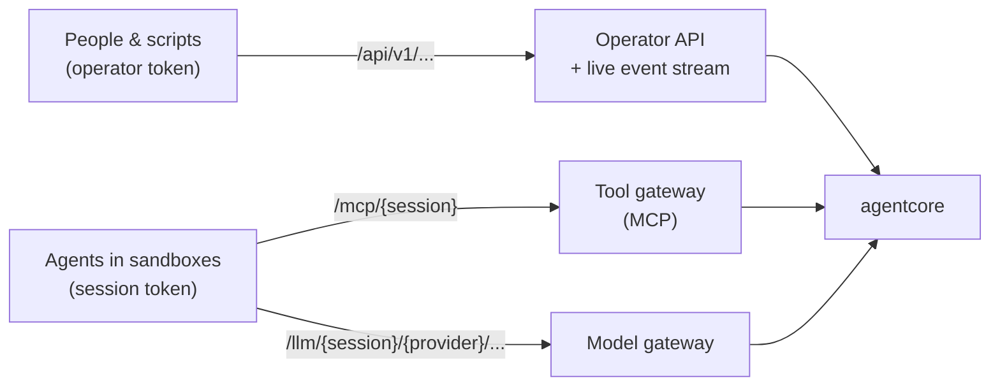
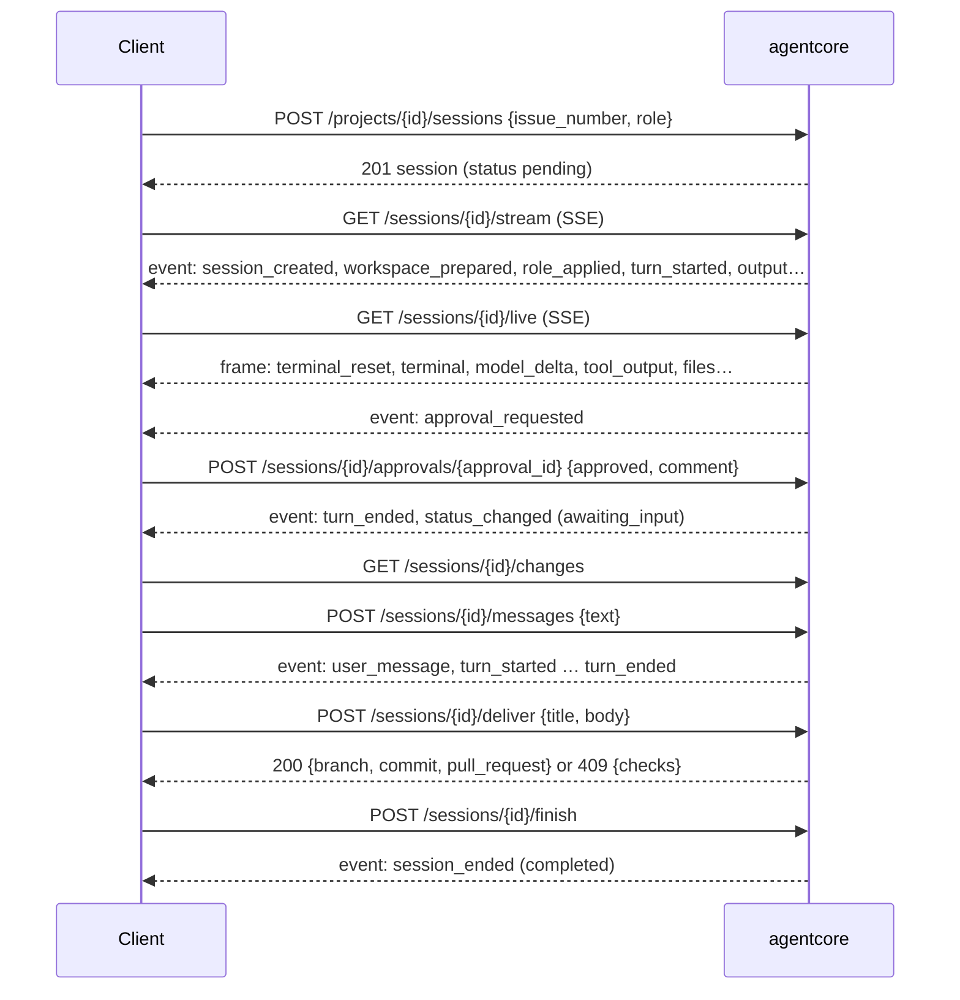

# API reference

agentcore exposes three HTTP surfaces:



| Surface | Callers | Authentication |
|---|---|---|
| `/api/v1/...` | the web UI, scripts, CI | `Authorization: Bearer <operator token>` (none when no operators are configured and the server is on loopback) |
| `/mcp/{session}` | the agent of that session | `Authorization: Bearer <session token>` (`$AGENTCORE_GATEWAY_TOKEN`) |
| `/llm/{session}/{provider}/...` | the agent of that session | session token as `x-api-key`, `Authorization: Bearer`, or `x-agentcore-token` |

Session tokens are random per session and stop working when it ends. Errors
are JSON: `{"error": "..."}` (some include more fields, e.g. `checks`).

## A typical session from a client's point of view



## Operator API (`/api/v1`)

Role needed: **V** viewer, **O** operator, **A** admin (each includes the ones
before).

### System

| Method & path | Role | Description |
|---|---|---|
| `GET /health` | none | Liveness: `{status, version}` |
| `GET /whoami` | V | `{name, role}` of the caller |
| `GET /system-card` | V | Transparency information, agents, policies with rules and digests |
| `POST /stop-all` | O | Emergency stop of every live session. Body (optional): `{reason}` |

### Sessions

| Method & path | Role | Description |
|---|---|---|
| `GET /sessions` | V | All sessions (live and archived), newest first |
| `POST /sessions` | O | Free task without a project: `{agent, task, policy?}` |
| `GET /sessions/{id}` | V | `{session, live, policy, approvals, proposal, role}` |
| `POST /sessions/{id}/stop` | O | Stop now. Body (optional): `{reason}` |
| `POST /sessions/{id}/messages` | O | Follow-up message while `awaiting_input`: `{text}` → 202 |
| `POST /sessions/{id}/finish` | O | End a session that is `awaiting_input` as completed → 202 |
| `GET /sessions/{id}/events?after=<seq>` | V | Events as JSON (live from memory, archived from the verified audit log) |
| `GET /sessions/{id}/stream?after=<seq>` | V | Server-sent events, see below |
| `GET /sessions/{id}/approvals` | V | Pending approvals |
| `POST /sessions/{id}/approvals/{approval_id}` | O | `{approved, comment?}` → 204 |
| `GET /sessions/{id}/changes` | V | Commits, files and diff against the base commit (`null` for non-repository sessions) |
| `POST /sessions/{id}/checks` | O | Run the role's checks: `{passed, checks: [...]}` |
| `POST /sessions/{id}/deliver` | O | `{title?, body?, draft?}` (defaults from the agent's proposal) → `{branch, commit, pull_request: {number, url}, checks}`, or **409** `{error, checks}` when a required check fails |
| `GET /sessions/{id}/live` | V | Live view frames (SSE), see below |
| `POST /sessions/{id}/pause` | O | Freeze the agent and everything it runs → session info |
| `POST /sessions/{id}/resume` | O | Continue after a pause → session info |
| `GET /sessions/{id}/recording` | V | Terminal recording (asciicast v2; the recording so far while running), 404 if none |
| `GET /sessions/{id}/model-calls/{call_id}` | V | Full request/response of one LLM call |
| `GET /sessions/{id}/audit` | V | Download the audit log (JSON Lines) |
| `GET /sessions/{id}/audit/verify` | V | `{valid, records, head}` or `{valid: false, error}` |

### Projects and GitHub

| Method & path | Role | Description |
|---|---|---|
| `GET /projects` | V | Projects |
| `POST /projects` | A | `{name, repository: "owner/name", default_branch, agent, role, board?, notes}` |
| `PUT /projects/{id}` | A | Replace a project (same body) |
| `DELETE /projects/{id}` | A | Delete (sessions and audit logs are kept) |
| `GET /projects/{id}/board` | V | `{board: {title, columns, current_iteration, items[]}, config}` |
| `GET /projects/{id}/issues?state=open` | V | Issues (when the project has no board) |
| `POST /projects/{id}/sessions` | O | Start an agent: `{issue_number?, task?, role?, agent?, policy?}` |
| `GET /roles` | V | Roles with tools, checks, workflow and digest |
| `GET /integrations/github` | O | Connection (token hint only) |
| `PUT /integrations/github` | A | `{token?, api_url, web_url, commit_name, commit_email}` |
| `DELETE /integrations/github` | A | Disconnect |
| `POST /integrations/github/test` | A | `{login}` of the token's user |

`board` = `{owner, number, status_field?: "Status", iteration_field?, columns?: {ready, in_progress, in_review, done}}`.

### Model providers and admin log

| Method & path | Role | Description |
|---|---|---|
| `GET /providers` | O | Providers (key hint only) |
| `POST /providers` | A | `{name, kind: anthropic \| openai \| opencode_zen, base_url?, api_key, allowed_models?, enabled?}` |
| `PATCH /providers/{name}` | A | Any of `{base_url, api_key, allowed_models, enabled}` |
| `DELETE /providers/{name}` | A | Remove |
| `GET /admin-events` | A | Configuration change history |

### Live event stream (SSE)

`GET /sessions/{id}/stream` replays the session's events and then streams new
ones:

```
event: event
id: 12
data: {"id":"…","session_id":"…","seq":12,"timestamp":"…","event":"action_requested","action_id":"…","action":{"type":"exec","command":"cargo","args":["test"],"cwd":"/workspace"},"requested_by":{"kind":"agent","id":"opencode"}}
```

If a client falls behind, it receives `event: lagged` and the stream ends;
reconnect with `?after=<last seq>`. Event types: `session_created`,
`workspace_prepared`, `sandbox_started`, `role_applied`, `agent_started`,
`turn_started`, `output`, `action_requested`, `policy_evaluated`,
`approval_requested`, `approval_resolved`, `action_completed`, `model_call`,
`user_message`, `messages_delivered`, `checks_completed`, `pull_request_proposed`, `delivered`,
`status_changed`, `paused`, `resumed`, `stop_requested`, `turn_ended`,
`recording_closed`, `session_ended`. The same JSON objects form the audit log.
Session statuses: `pending`, `running`, `awaiting_approval`, `awaiting_input`,
`paused`, `stopped`, `completed`, `failed`.

### Live view stream (SSE)

`GET /sessions/{id}/live` streams what is happening in the sandbox right now
(nothing is replayed except the current screen):

```
event: frame
data: {"frame":"terminal_reset","data":"\u001b[2m── turn 1 ──…","cols":120,"rows":32}

event: frame
data: {"frame":"model_delta","call_id":"…","kind":"thinking","text":"Let me run the tests "}
```

| Frame | Fields | Meaning |
|---|---|---|
| `terminal_reset` | `data, cols, rows` | Sent first on every connection: recent terminal output to rebuild the screen |
| `terminal` | `data` | Agent terminal output (UTF-8, ANSI escape sequences included) |
| `tool_output` | `action_id, stream, data` | Output of a command run for a tool call, as it is produced |
| `model_start` | `call_id, provider, model` | A model call started streaming |
| `model_delta` | `call_id, kind, text` | `kind`: `text`, `thinking`, `tool_name`, `tool_input` (partial JSON) |
| `model_end` | `call_id` | The call finished |
| `files` | `changes: [{path, kind, at}]` | Files `created`, `modified` or `removed` in the workspace (`.git` ignored) |
| `processes` | `processes: [{pid, elapsed, command}]` | Processes in the sandbox (while someone watches) |

`event: lagged` means the client fell behind: reconnect. `event: ended` means
the session is over (also sent at once for finished sessions); use
`/recording` for the replay.

## Agents (`/api/v1/agents`)

| Method & path | Role | What |
|---|---|---|
| `GET /agents/catalog` | viewer | The [agent catalogue](AGENT_CATALOG.md): each entry with license, protocols, guardrail level, verified version, and the names it was added as |
| `GET /agents` | viewer | Every agent: from the configuration file (`source: config`) and added from the catalogue (`source: catalog`) |
| `POST /agents` | admin | Add a catalogue agent: `{"catalog": "codex", "name": "codex", "provider": "openai", "model": "gpt-5.1", "policy"?, "image"?, "description"?}`. The provider must be of a kind the agent speaks; the model must pass the provider's allow-list. |
| `PUT /agents/{name}` | admin | Change `provider`, `model`, `policy`, `image`, `description`, `enabled` (re-created from the current catalogue entry) |
| `DELETE /agents/{name}` | admin | Remove an added agent (running sessions continue) |
| `POST /agents/{name}/check` | operator | Start a throwaway sandbox and look for the agent's program: `{"available", "path", "version", "hint"}` |

## Organisations (`/api/v1/org`)

Departments, their agents, messages and department files, plus control at
every level. The full list is in
[Multi-agent organisations](MULTI_AGENT.md#api). `GET /org/stream` is an SSE
stream of change notifications (`event: org`, data `{"kind": ...}`); clients
refetch what changed.

Building from templates: `GET /org/templates` (categories, department
templates, blueprints), `GET`/`PUT /org/profile` (company name, description,
growth path), `GET /org/suggestions` (what to add next) and
`POST /org/build` (admin):

```json
{ "profile": {"company_name": "Acme", "company_about": "...", "blueprint": "solo-developer"},
  "departments": ["engineering"], "size": "lean", "agent": "opencode",
  "start": true, "goal": "Reach 10 paying customers", "check_ins": true,
  "raise_limits": false, "dry_run": false }
```

Goals (`/org/goals`) and scheduled check-ins
(`/org/departments/{id}/checkins`, `/org/checkins/{id}`) keep an
organisation working without a person writing to it; see
[Goals, check-ins and agents that keep going](MULTI_AGENT.md#goals-check-ins-and-agents-that-keep-going).

Metrics (`GET /org/metrics?days=`), improvement proposals
(`/org/proposals`, apply / change / send back / reject, `/org/auto-apply`),
business data sources (`/org/data-sources`), and prices and budgets
(`/org/spending`, `/org/prices`, `/org/budgets`, `/org/currency`), and the
outbox and channels (`/org/outbox`, `/org/channels`): see
[Talking to the outside world](MULTI_AGENT.md#talking-to-the-outside-world),
[Spending and budgets](MULTI_AGENT.md#spending-and-budgets),
[Business data](MULTI_AGENT.md#business-data) and
[Metrics, the retrospective and improvements](MULTI_AGENT.md#metrics-the-retrospective-and-improvements).

`dry_run` returns the plan only. A plan that does not fit the limits is
refused with `409` (the body holds the plan) unless `raise_limits` is set.

Session endpoints (`/sessions/{id}/...`) work on any node: a node that does
not run the session forwards the request (streams included) to the node
that does, or answers `503` if that node is unreachable.

## Tool gateway (`/mcp/{session}`)

MCP over Streamable HTTP (JSON responses, protocol `2025-06-18`). Methods:
`initialize`, `ping`, `tools/list`, `tools/call`; `GET` returns 405.

| Tool | Action | Notes |
|---|---|---|
| `run_command {command, args?, cwd?}` | `exec` | No shell; use `sh -c` explicitly (usually needs approval) |
| `read_file {path}` | `file_read` | |
| `write_file {path, content}` | `file_write` | Audit records the SHA-256 of the content |
| `list_files {path?}` | `exec` (`ls -la`) | |
| `github_*`, `propose_pull_request` | `tool_call` | Only those the session's role allows; see [Ways of working](WAYS_OF_WORKING.md) |
| `team_*` | `tool_call` | Department agents: messages, department files, goals ([Agent tools](MULTI_AGENT.md#agent-tools)) |
| `data_list_sources`, `data_query` | `tool_call` | Workers of departments granted business data ([Business data](MULTI_AGENT.md#business-data)) |
| `insights_*` | `tool_call` | Workers of departments granted `insights`: metrics and proposals ([The retrospective](MULTI_AGENT.md#the-retrospective)) |
| `outbox_*` | `tool_call` | Workers of departments that may use a channel: drafts people approve ([Talking to the outside world](MULTI_AGENT.md#talking-to-the-outside-world)) |

A session only sees the tools it may use; a tool that is not listed is also
refused if called.

Every call is policy-checked; denied calls return an error result starting
with `DENIED:` and "Do not retry this action".

## Model gateway (`/llm/{session}/{provider}/...`)

A transparent reverse proxy: the agent calls `/llm/{session}/{provider}/v1/messages`
(or `/v1/chat/completions`, …) exactly as it would call the provider. agentcore
replaces the session token with the provider's real key, streams the response
back and records the call, priced with the model's price if one is set
([Spending and budgets](MULTI_AGENT.md#spending-and-budgets)).

| Status | Meaning |
|---|---|
| 400 | Invalid path (`.` / `..` segments) |
| 401 | Unknown session or wrong token |
| 403 | Session stopped, provider disabled, model not in `allowed_models`, or a `pause` budget covering the session's department (or the organisation) is used up |
| 404 | No provider with that name |
| 429 | `max_model_calls` reached |
| 502 | Provider unreachable |

Agents normally don't build these URLs themselves: agentcore sets
`ANTHROPIC_BASE_URL`, `OPENAI_BASE_URL` and the matching `*_API_KEY`
variables (see [Architecture](ARCHITECTURE.md#agents-and-adapters)).
