# Architecture

This document explains how agentcore is built and how its parts interact.
For *using* it, start with the [README](../README.md); for the concepts behind
roles, read [Ways of working](WAYS_OF_WORKING.md).

- [System overview](#system-overview)
- [Crates](#crates)
- [Session lifecycle](#session-lifecycle)
- [Event pipeline](#event-pipeline)
- [Life of an action](#life-of-an-action)
- [Stopping](#stopping)
- [Live view: watching the agent work](#live-view)
- [Pausing](#pausing)
- [Model gateway](#model-gateway)
- [Team work: repository, conversation, delivery](#team-work)
- [Persistence](#persistence)
- [Agents and adapters](#agents-and-adapters)
- [Sandbox backends](#sandbox-backends)
- [Roadmap](#roadmap)

## System overview

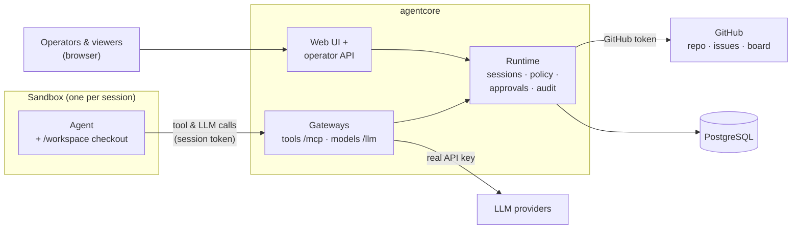

The agent can only reach agentcore. Every side effect is a tool call through
the tool gateway, which the runtime checks against policy and then executes
inside the sandbox (or on GitHub); every LLM call goes through the model
gateway. Real
credentials (model API keys, the GitHub token) never enter the sandbox.

## Crates

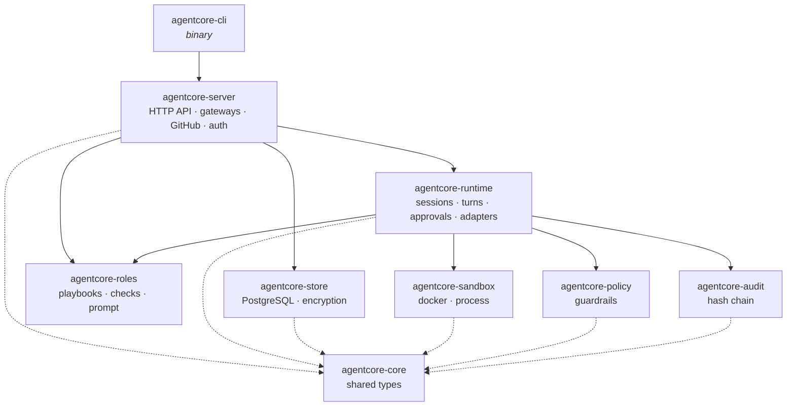

| Crate | Responsibility |
|---|---|
| **core** | Shared types: `Action` (exec, file read/write, network, tool call), `Event`, `Principal` (human, agent, system), `SessionInfo`/`SessionContext`, `AgentAdapter`, model and work types (`Changes`, `CheckResult`, ...). |
| **policy** | Compiles TOML guardrail policies into glob matchers and evaluates actions with deny-overrides semantics. Normalises paths before matching. |
| **audit** | One append-only JSONL file per session; each record contains the SHA-256 of the previous one. Existing files are verified before they are extended. |
| **sandbox** | `SandboxProvider` creates a `Sandbox` that can spawn the agent (in a pseudo-terminal), run commands (streaming their output), read/write workspace files, list its processes, `pause()`/`resume()` and `kill()` everything. Backends: Docker (hardened), process (dev only). |
| **roles** | Role (playbook) files, capability → tool mapping, check definitions, and composition of the agent's first prompt. |
| **runtime** | `SessionManager` and `Session`: turns, policy gating, approvals, stop, pause/resume, the live view (`LiveHub`: terminal, recording, files, processes), change snapshots, checks, git bundle export, built-in adapters. |
| **store** | PostgreSQL: session index, model providers, GitHub connection (secrets AES-256-GCM encrypted), projects, model calls, change snapshots, admin log, organisations (departments, agents, messages, inboxes, department files, profile and limits), node registry. |
| **server** | axum: operator API, SSE event and live streams, MCP tool gateway, model gateway (including the token stream for the live view), GitHub client and tools, repository checkout and delivery, auth, UI hosting, organisations (`org.rs`), templates (`templates.rs`), cluster (`cluster.rs`). |
| **cli** | `agentcore serve`, `policy check/eval`, `audit verify/show`, `hash-token`. |

## Session lifecycle

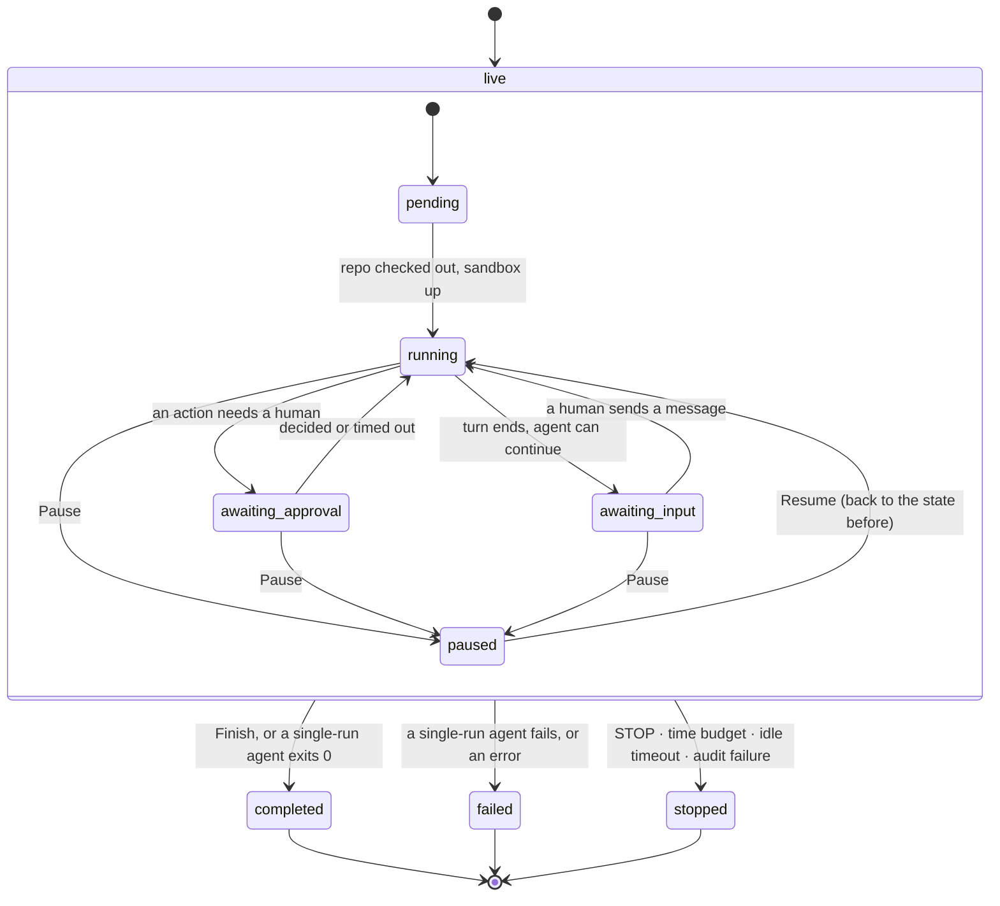

* A **turn** is one run of the agent process. Agents that can continue a
  conversation (opencode with `--continue`, CLI agents with `follow_up_args`)
  go to `awaiting_input` after each turn, with the sandbox kept alive;
  others end after the first run.
* While `awaiting_input`, a human can send messages, look at the changes, run
  checks and deliver.
* Limits from the guardrail policy: `max_session_secs` (whole session),
  `idle_timeout_secs` (waiting for a human), `max_actions`,
  `max_model_calls`, `approval_timeout_secs`.
* On restart, sessions that were live are marked `failed`, their audit logs
  closed with a `session_ended` event, and leftover containers removed.

## Event pipeline

Every state change is an `Event`, recorded through one function:

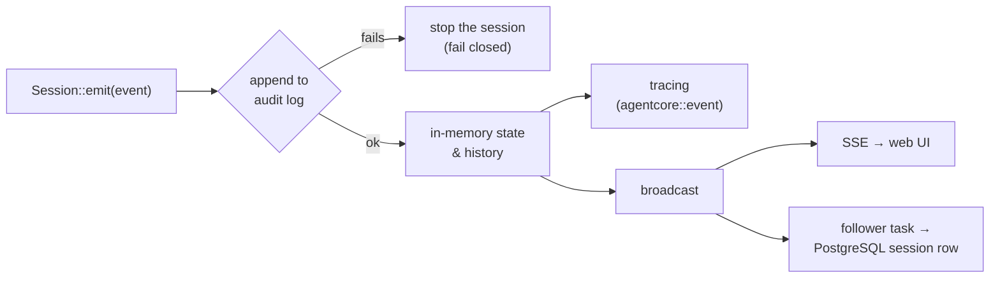

The UI, the audit log and the operational logs are three views of the same
event sequence. If an event cannot be recorded, the agent is stopped: an
unrecorded agent must not keep acting.

## Life of an action

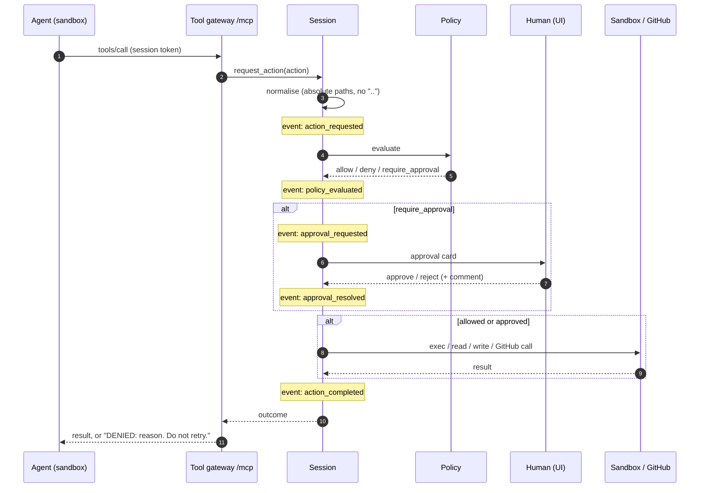

Built-in tools (`run_command`, `read_file`, `write_file`, `list_files`) run in
the sandbox. Role tools (`github_*`, `propose_pull_request`) are executed by
agentcore, but go through exactly the same policy, approval and audit steps.

## Stopping

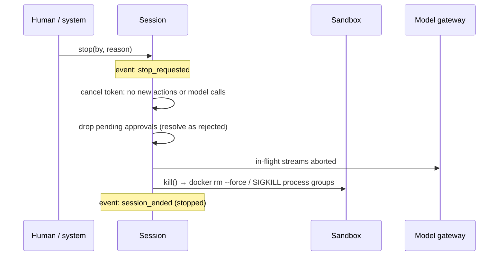

Triggered by **STOP AGENT**, **Stop all agents**, `POST /sessions/{id}/stop`,
`POST /stop-all`, the time budget, the idle timeout, an audit failure, or
server shutdown. Stopping also works while a session is paused.

## Live view: watching the agent work

People trust what they can see. The live view shows a running session the way
a screen share would: the agent's own terminal, the command it is running
right now with its output, what the model is thinking and writing as the
tokens arrive, the files it touches and the processes in its sandbox.

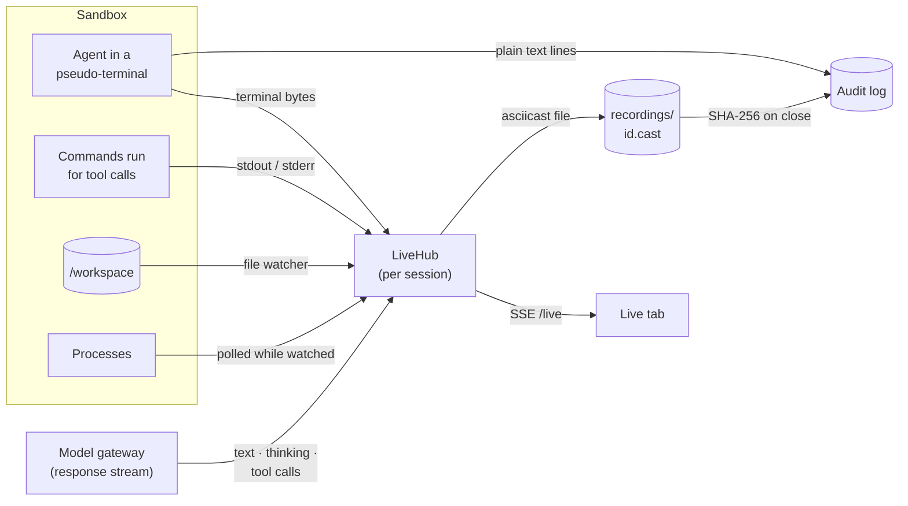

* **Terminal.** Agents run in a pseudo-terminal of 120×32 (`openpty` for the
  process backend, `docker exec --tty` for Docker), so they print exactly what
  a developer would see: colours, progress, tool banners. Set `tty = false`
  on an agent that misbehaves in a terminal.
* **Frames, not events.** Live frames (`terminal`, `tool_output`,
  `model_start/delta/end`, `files`, `processes`) are high-volume and
  ephemeral; they go to viewers only. What matters for the record is still
  audited: output as ANSI-free text lines, every action and model call, and
  the terminal recording.
* **Late viewers.** A viewer who opens the tab gets the last 256 KiB of
  terminal output (`terminal_reset`), recent file changes and the current
  processes first, so the screen is complete immediately. A viewer that falls
  behind is told to reconnect (`lagged`) and gets a fresh screen.
* **Recording.** The terminal is written to `data/recordings/<session>.cast`
  (asciicast v2, with a chapter marker per turn and banners for pause, resume
  and stop). When the session ends, its size and SHA-256 are recorded in the
  hash-chained audit log (`recording_closed`), so a replay can be proven to be
  the original. Finished sessions show a *Replay* tab.
* **Model stream.** The model gateway already relays the provider's response;
  it also parses Anthropic Messages, OpenAI Chat Completions and OpenAI
  Responses streams (and plain JSON answers) into text, thinking and tool-call
  deltas for the live view.
* **Cost.** The process list is only polled (every 2 s) while someone watches;
  file changes are debounced and ignore `.git`.

## Pausing

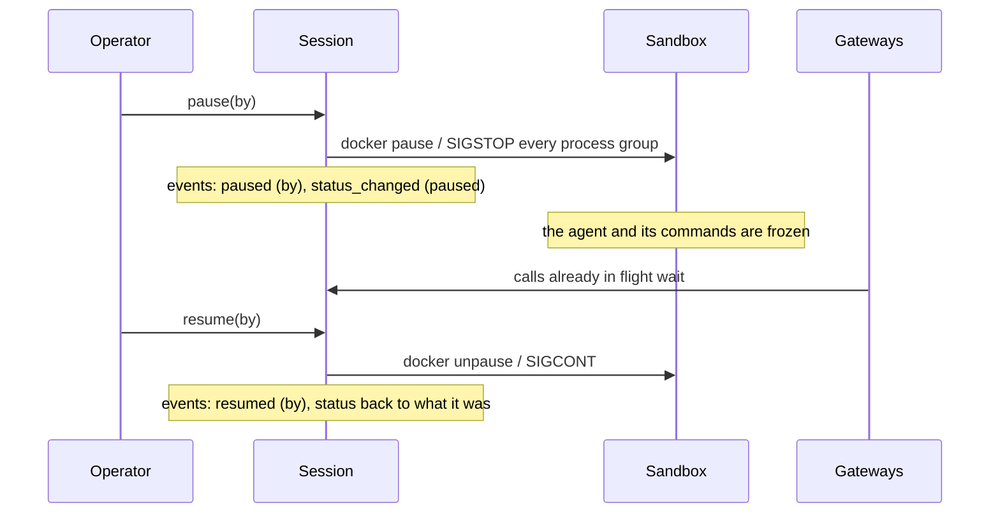

Pausing freezes everything without losing state: the agent continues exactly
where it was. Status changes that happen while paused (an approval answered,
say) are applied on resume. The session's time budget keeps running while it
is paused; approvals keep their timeouts.

## Model gateway

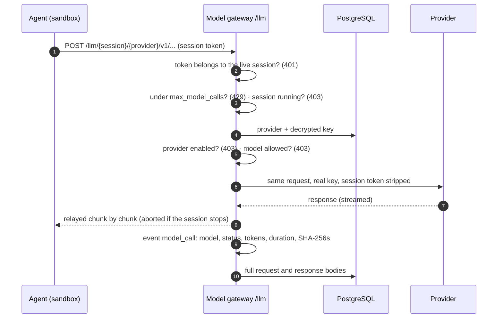

Every agent gets `ANTHROPIC_BASE_URL`/`ANTHROPIC_API_KEY` and
`OPENAI_BASE_URL`/`OPENAI_API_KEY` pointing at the gateway (with the session
token as the key) for the first enabled provider of each kind; the opencode
adapter configures opencode's `anthropic`, `openai` and `opencode` (Zen)
providers the same way. Refused calls are recorded too.

## Team work

### Starting an agent on an issue

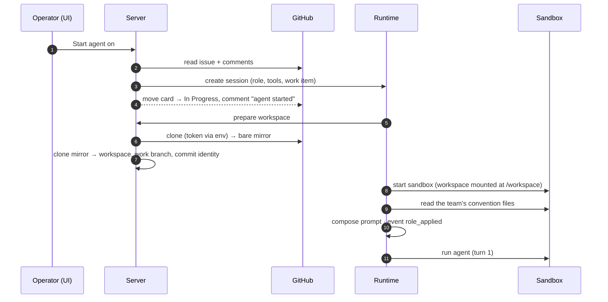

### The repository and its boundary

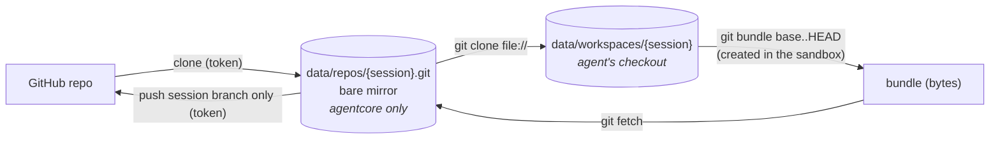

agentcore never runs git in the agent-controlled checkout on the host.
Everything crossing the boundary is a bundle, which is plain data. Hooks,
fsmonitor and credential helpers are disabled for every git command agentcore
runs, and the token is passed as an HTTP header through environment variables.

### First prompt

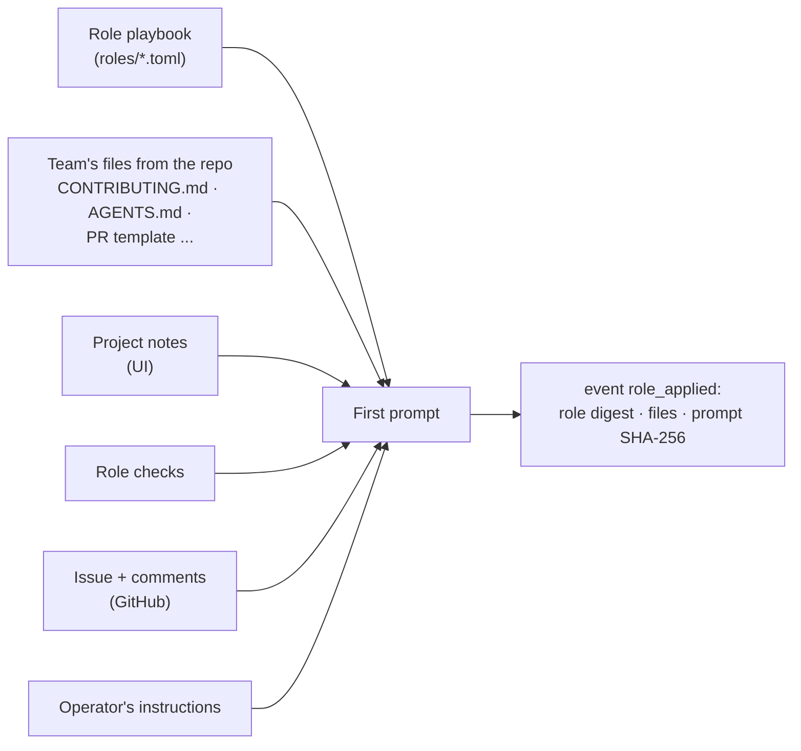

The convention files are read **inside the sandbox**, so a symlink in the
repository cannot make agentcore read a host file.

### Delivery

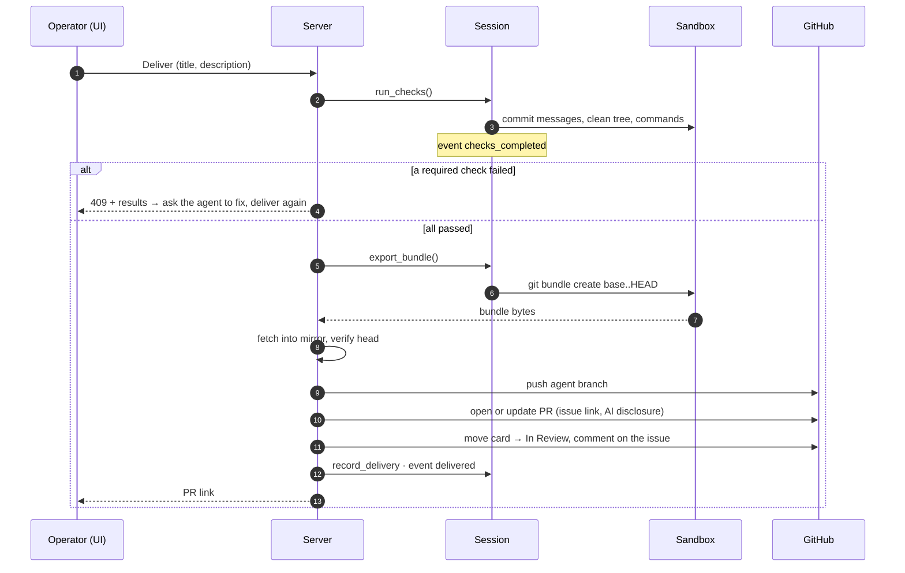

Delivery is possible while the agent waits for input. After review comments,
continue the session and deliver again: the same pull request is updated.

## Persistence

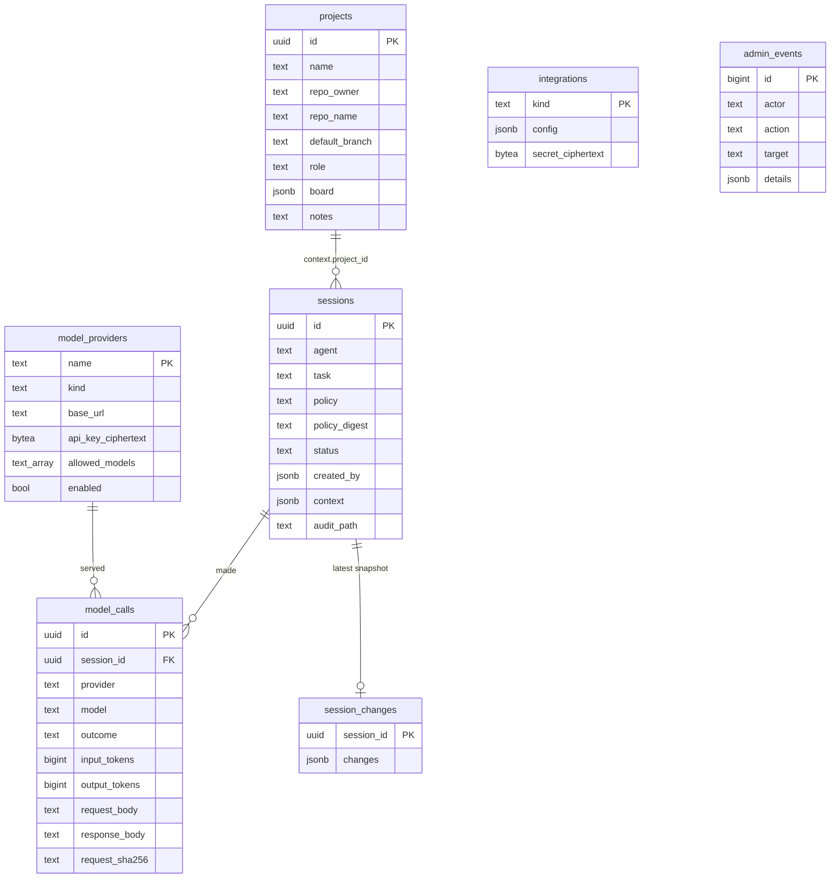

| Data | Where | Why |
|---|---|---|
| Session events | `data/audit/<session>.jsonl` | Tamper-evident hash chain; the authoritative record |
| Organisations, messages, department files, nodes | PostgreSQL (migrations `0004`, `0005`; see [Multi-agent organisations](MULTI_AGENT.md#data-model)) | Shared by every node |
| Sessions, projects, providers, GitHub connection, model calls, changes, admin log | PostgreSQL (migrations in `crates/agentcore-store/migrations`) | Queryable state that survives restarts |
| Repository mirrors and workspaces | `data/repos/`, `data/workspaces/` | Agent checkouts and agentcore's push source |
| Master key | `data/master.key` or `$AGENTCORE_MASTER_KEY` | Decrypts provider keys and the GitHub token; back it up |

## Agents and adapters

An agent is configured as an `AgentSpec` (`[[agents]]` in the config) and
launched by an `AgentAdapter`, which turns spec + task into a `LaunchPlan`
(program, args, env), and optionally a plan for follow-up turns.

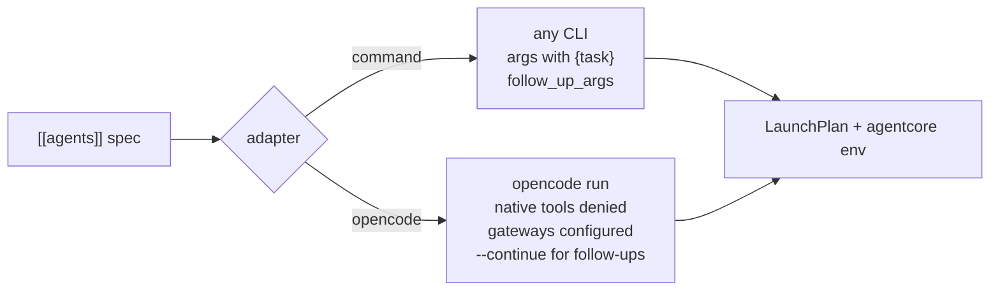

agentcore injects into every agent's environment (not into the audited
arguments):

| Variable | Purpose |
|---|---|
| `AGENTCORE_GATEWAY_URL`, `AGENTCORE_GATEWAY_TOKEN` | MCP tool gateway for this session, and its token |
| `AGENTCORE_MODEL_GATEWAY_URL` | Model gateway base for this session |
| `ANTHROPIC_*`, `OPENAI_*` | Standard SDK variables pointing at the model gateway |
| `AGENTCORE_SESSION_ID`, `AGENTCORE_WORKSPACE` | Context |
| `AGENTCORE_AI_GENERATED` | Marker for AI-generated output (Art. 50) |

Adding a new agent:

* **any CLI agent**: use the `command` adapter, point its MCP client at
  `$AGENTCORE_GATEWAY_URL` and its model SDK at the standard variables;
  set `follow_up_args` if it can continue a conversation;
* **deeper integration**: implement `AgentAdapter` (see `OpenCodeAdapter`,
  which disables all of opencode's native file, shell and web tools,
  including read/grep/glob, so the model has to use the policy-checked
  gateway tools) and register it in `AdapterRegistry`.

Agents with built-in tools that bypass the gateway are still confined by the
sandbox, but the policy only governs what goes through the gateway, so
disable native side-effecting tools where the agent allows it.

## Sandbox backends

| Backend | Isolation | Use |
|---|---|---|
| `docker` | Container per session: no capabilities, `no-new-privileges`, read-only root, non-root user, resource limits, `network=none` or an internal network; optional gVisor/Kata runtime | Production |
| `process` | None: host processes in the workspace directory | Developing agentcore only |

| Backend | Agent terminal | Pause | Processes |
|---|---|---|---|
| `docker` | `docker exec --tty`, size set with `stty` | `docker pause` (cgroup freezer) | `docker top` |
| `process` | `openpty` | `SIGSTOP`/`SIGCONT` to every process group | `ps`, filtered by process group |

New backends implement `SandboxProvider` + `Sandbox` (spawn, exec,
read/write file, pause, resume, processes, kill, destroy, cleanup of
orphans). Candidates: Firecracker
microVMs, Kubernetes pods, remote sandboxes.

## Organisations and clusters

Departments of agents, communicators, message routing and running on
several VMs are described in [Multi-agent organisations](MULTI_AGENT.md).
In short: `org.rs` (server) holds the API, the `team_*` tools and message
routing; `templates.rs` loads department templates and growth paths, plans
what to create and suggests what to add next; `cluster.rs` holds the node heartbeat, the `LISTEN/NOTIFY`
listener, the reconciler that converges this node's sessions to the desired
state in PostgreSQL, and request forwarding to the node that owns a session.

## Roadmap

* **Steering**: interrupt a running turn with a message (not only between
  turns), and take over the agent's terminal.
* **Annotations**: viewers bookmark and comment moments in a live session or
  replay.
* **Event-driven pickup**: agents take cards labelled `agent` from the *Ready*
  column automatically (within a WIP limit), and react to PR review comments
  by continuing their session.
* **GitHub App** authentication (per-installation tokens) instead of a token.
* **Other trackers**: GitLab, Jira, Linear behind the same project/board model.
* **Editors in the UI** for roles, policies, agents and operators.
* **Egress proxy**: network access per policy `network` rules.
* **OpenTelemetry export**; SIEM forwarding of audit logs.
* **SSO (OIDC)** for operators.
* **Spend limits**: token/cost budgets per session and provider.
* **External anchoring** of audit chain heads (WORM storage / transparency log).
