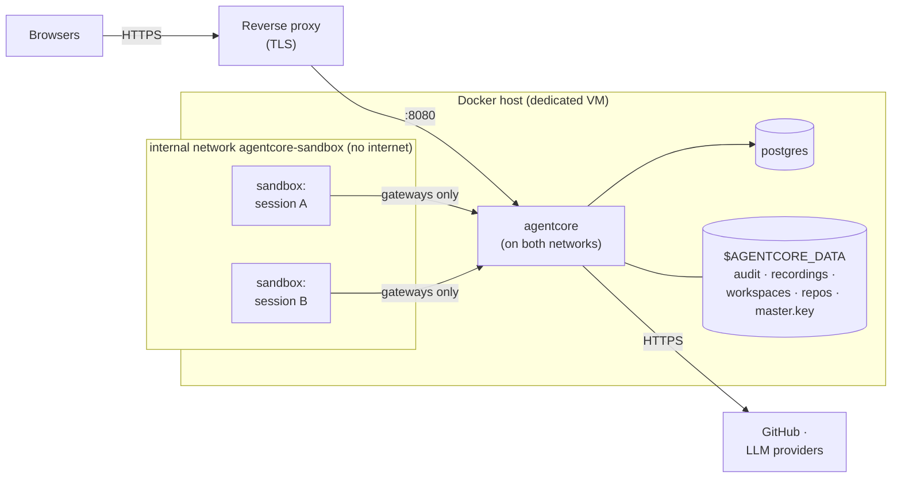
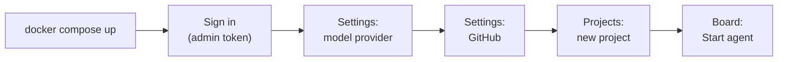
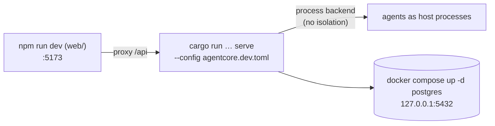

# Deployment

## Topology (docker-compose)



* agentcore is attached to both networks. Sandboxes are only on
  `agentcore-sandbox`, which is `internal`: they can reach agentcore's tool
  and model gateways and nothing else, not even the internet.
* agentcore starts sandboxes through the Docker socket of the host, so
  workspace directories are mounted **by the host's Docker daemon**. The data
  directory must therefore exist at the same absolute path on the host and
  inside the agentcore container; `AGENTCORE_DATA` sets both.
* Mounting the Docker socket gives agentcore root-equivalent power over the
  host: run it on a dedicated VM (or with rootless Docker / Podman).

## Install

```sh
git clone <this repository> && cd agentcore
docker build -t agentcore-sandbox:latest sandbox-image      # image agents run in (includes opencode)
cp deploy/agentcore.toml.example deploy/agentcore.toml
docker compose run --rm agentcore hash-token 'a-long-random-token'
#   → put the hash into [[server.operators]] (role = "admin") in deploy/agentcore.toml
export AGENTCORE_DATA=$HOME/agentcore-data                 # absolute host path
export POSTGRES_PASSWORD=$(openssl rand -hex 16)
mkdir -p "$AGENTCORE_DATA"
docker compose up -d
```

Then open the UI, sign in with your token and, in **Settings**:

1. add a model provider (Anthropic, OpenAI or OpenCode Zen with an API key);
2. connect GitHub (token of a bot account or a fine-grained token);
3. in **Projects**, create a project for a repository and its board.



### macOS / Docker Desktop

Docker Desktop only shares some host folders with containers (by default
`/Users`, `/Volumes`, `/private`, `/tmp`). Put `AGENTCORE_DATA` under your
home folder, e.g. `$HOME/agentcore-data`. A path such as `/srv/...` fails with
*"Mounts denied: the path … is not shared from the host"*.

### TLS and the public URL

Put a TLS-terminating reverse proxy (Caddy, nginx, Traefik) in front of port
8080 and set `[server].public_url` so GitHub comments link back to sessions.
Never expose port 8080 directly.

### gVisor

For untrusted agents, install [gVisor](https://gvisor.dev) on the host and set
`[sandbox.docker] runtime = "runsc"`.

## Local development



```sh
docker compose up -d postgres
(cd web && npm ci && npm run build)
cargo run -p agentcore-cli -- serve --config agentcore.dev.toml
```

The `process` backend runs agents on your machine **without isolation**; use
it only to develop agentcore itself.

## Operations

| Task | How |
|---|---|
| Backups | PostgreSQL (`pg_dump`), `$AGENTCORE_DATA/audit` and `$AGENTCORE_DATA/recordings`, and the master key, stored **separately** from the database backup |
| Upgrades | Pull, rebuild, `docker compose up -d`. Database migrations run automatically at startup. |
| Restarts | Sessions that were running are marked failed, their audit logs closed, leftover sandbox containers removed. |
| Logs | `docker compose logs agentcore` (JSON with `--log-format json`); filter with `AGENTCORE_LOG`. |
| Audit verification | UI (session → Audit → Verify) or `agentcore audit verify $AGENTCORE_DATA/audit/*.jsonl` |
| Emergency | **Stop all agents** in the UI, or `POST /api/v1/stop-all` |

See [SECURITY.md](../SECURITY.md) for the hardening checklist and
[Configuration](CONFIGURATION.md) for every setting.
