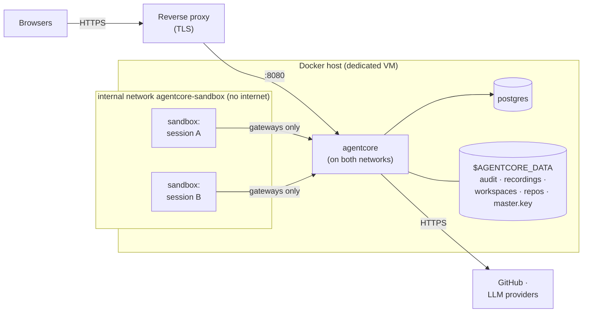
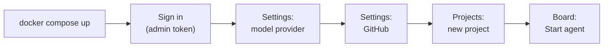
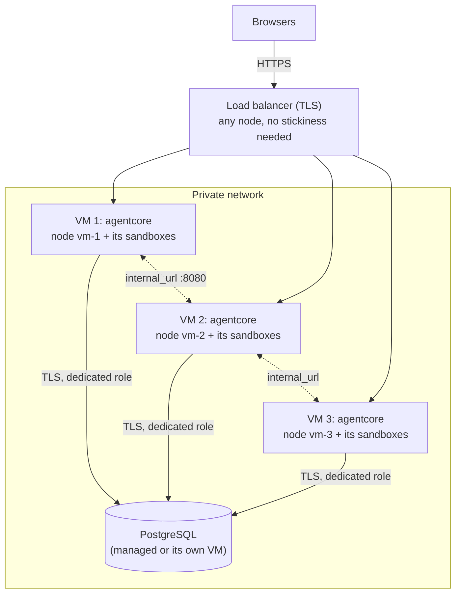
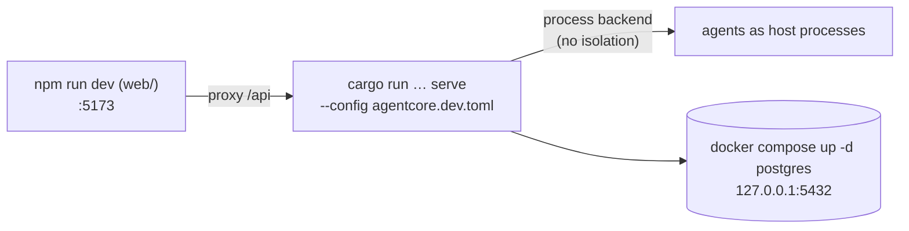

# Deployment

## Topology (docker-compose)



* agentcore is attached to both networks. Sandboxes are only on
  `agentcore-sandbox`, which is `internal`: they can reach agentcore's tool
  and model gateways and nothing else, not even the internet.
* agentcore starts sandboxes through the Docker socket of the host, so
  workspace directories are mounted **by the host's Docker daemon**. The data
  directory must therefore exist at the same absolute path on the host and
  inside the agentcore container; `AGENTCORE_DATA` sets both.
* Mounting the Docker socket gives agentcore root-equivalent power over the
  host: run it on a dedicated VM (or with rootless Docker / Podman).

## Install

```sh
git clone <this repository> && cd agentcore
docker build -t agentcore-sandbox:latest sandbox-image      # image agents run in (includes opencode)
cp deploy/agentcore.toml.example deploy/agentcore.toml
docker compose run --rm agentcore hash-token 'a-long-random-token'
#   → put the hash into [[server.operators]] (role = "admin") in deploy/agentcore.toml
export AGENTCORE_DATA=$HOME/agentcore-data                 # absolute host path
export POSTGRES_PASSWORD=$(openssl rand -hex 16)
mkdir -p "$AGENTCORE_DATA"
docker compose up -d
```

Then open the UI, sign in with your token and, in **Settings**:

1. add a model provider (Anthropic, OpenAI or OpenCode Zen with an API key);
2. connect GitHub (token of a bot account or a fine-grained token);
3. in **Projects**, create a project for a repository and its board, and/or
4. in **Organisation**, build departments of agents from templates
   ([Multi-agent organisations](MULTI_AGENT.md)).



### macOS / Docker Desktop

Docker Desktop only shares some host folders with containers (by default
`/Users`, `/Volumes`, `/private`, `/tmp`). Put `AGENTCORE_DATA` under your
home folder, e.g. `$HOME/agentcore-data`. A path such as `/srv/...` fails with
*"Mounts denied: the path … is not shared from the host"*.

### TLS and the public URL

Put a TLS-terminating reverse proxy (Caddy, nginx, Traefik) in front of port
8080 and set `[server].public_url` so GitHub comments link back to sessions.
Never expose port 8080 directly.

### gVisor

For untrusted agents, install [gVisor](https://gvisor.dev) on the host and set
`[sandbox.docker] runtime = "runsc"`.

## Several VMs

One VM runs everything shown above. To run more agents than one VM can hold,
run the same agentcore on several VMs ("nodes") that share one PostgreSQL
database. There is no separate controller: every node serves the UI and API,
runs its own sandboxes, and agents are placed on the least loaded node. How
it works: [Multi-agent organisations](MULTI_AGENT.md#running-on-several-vms).



1. **Database.** One PostgreSQL ≥ 14 reachable from every VM (a managed
   instance, or the `postgres` service of one compose file exposed on the
   private network only). Use TLS (`?sslmode=require`) and a dedicated role.
2. **The same secrets everywhere.** Copy `master.key` from the first node to
   the others (or set the same `$AGENTCORE_MASTER_KEY` on all), so every node
   can decrypt the provider keys stored in the database.
3. **The same configuration everywhere**, except `[cluster]`: identical
   `[[server.operators]]` (a request forwarded to another node is
   authenticated again there), `[[agents]]`, policies, roles and templates.
4. **Per node**, in `agentcore.toml`:

   ```toml
   [database]
   url = "postgres://agentcore:…@db.internal:5432/agentcore?sslmode=require"

   [cluster]
   node_name = "vm-2"                        # unique
   internal_url = "http://10.0.0.12:8080"    # reachable from the other nodes
   max_agents = 20                           # department agents on this VM
   ```

   Size `max_agents` to the VM: each agent is a sandbox container with the
   CPU and memory limits from `[sandbox.docker]`.
5. **Network.** Nodes must reach each other's `internal_url` (port 8080) on
   the private network; sandboxes still only reach their own node. Do not
   expose `internal_url` publicly.
6. **Start** each node. With the bundled compose file, nodes that use an
   external database start only agentcore: `docker compose up -d --no-deps
   agentcore` (the `postgres` service runs on the database VM only). The Organisation page
   lists the nodes, whether they are alive and how many agents each runs.

Adding a node later: start it with a new `node_name`; new agents are placed
on it as soon as its heartbeat arrives. Removing a node: stop the agents
placed on it (or let them finish), then shut it down; if it disappears
unannounced, its agents are marked failed after `node_timeout_secs`.

Data stays on the node that ran the session: audit logs, recordings and
workspaces are in that VM's `$AGENTCORE_DATA`. Back up every node's data
directory. Viewing a session from another node works while its node is up.

## Local development



```sh
docker compose up -d postgres
(cd web && npm ci && npm run build)
cargo run -p agentcore-cli -- serve --config agentcore.dev.toml
```

The `process` backend runs agents on your machine **without isolation**; use
it only to develop agentcore itself.

## Operations

| Task | How |
|---|---|
| Backups | PostgreSQL (`pg_dump`), `$AGENTCORE_DATA/audit` and `$AGENTCORE_DATA/recordings`, and the master key, stored **separately** from the database backup |
| Upgrades | Pull, rebuild, `docker compose up -d`. Database migrations run automatically at startup. |
| Restarts | Sessions that were running on the restarted node are marked failed, their audit logs closed, leftover sandbox containers removed. Department agents that were running there are marked stopped ("its node restarted"); start them again from the Organisation page. Other nodes are not affected. |
| Upgrades with several nodes | Upgrade one node at a time; migrations run on the first node that starts the new version, so read the release notes for changes that older nodes cannot handle. |
| Logs | `docker compose logs agentcore` (JSON with `--log-format json`); filter with `AGENTCORE_LOG`. |
| Audit verification | UI (session → Audit → Verify) or `agentcore audit verify $AGENTCORE_DATA/audit/*.jsonl` |
| Emergency | **Stop all agents** in the UI, or `POST /api/v1/stop-all`: stops every agent on every node |

See [SECURITY.md](../SECURITY.md) for the hardening checklist and
[Configuration](CONFIGURATION.md) for every setting.
