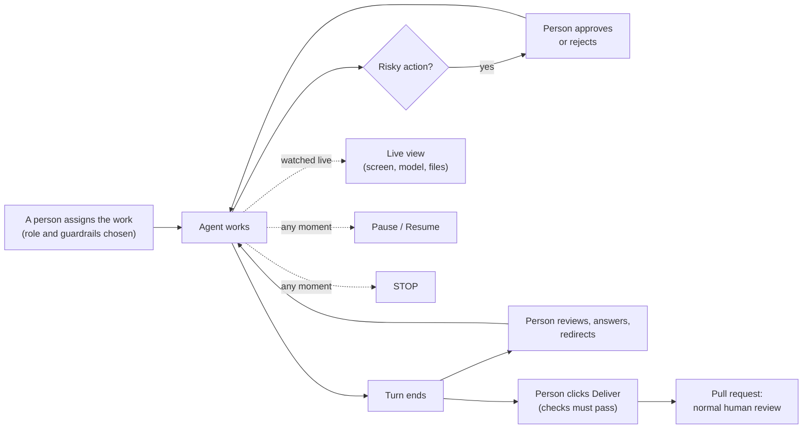

# EU AI Act support

> This document explains how agentcore's features support the obligations of
> Regulation (EU) 2024/1689 (the "AI Act"). It is engineering documentation,
> **not legal advice**. Whether, and in which role (provider or deployer), the
> obligations apply to you depends on your use case. Involve your legal and
> compliance teams.

## Is an AI coding agent "high-risk"?

Usually not. General software-development assistance is not listed in
Annex III. It can become high-risk, or fall under other rules, depending on
what the agent is used for (for example, if its work feeds decisions about
employees, or it becomes a safety component of a regulated product).
agentcore is built so the high-risk requirements can be met anyway: they are
also good engineering practice for autonomous agents, and the transparency
(Art. 50) and AI literacy (Art. 4) duties apply regardless of risk class.

Application dates: Art. 4 and the prohibitions since 2 Feb 2025; GPAI model
obligations since 2 Aug 2025; most remaining obligations, including Art. 50 and
Annex III high-risk systems, from 2 Aug 2026; Annex I products from 2 Aug 2027.
Check for amendments (such as the "Digital Omnibus" proposals) that may shift
the high-risk dates.

## Mapping

| Article | Requirement (summary) | agentcore feature | Your responsibility |
|---|---|---|---|
| **Art. 9** Risk management | Identify, evaluate and mitigate risks throughout the lifecycle. | Policies encode risk decisions per action type; sandbox limits blast radius; limits on time and number of actions. | Run and document a risk assessment for your use cases; review policies regularly. |
| **Art. 11 / Annex IV** Technical documentation | Describe the system, its components and its logic. | `docs/ARCHITECTURE.md`, `docs/POLICIES.md`, the system card (`/api/v1/system-card`), policy digests. | Add your deployment details, models used and intended purpose. |
| **Art. 12** Record-keeping | Automatic logging of events over the system's lifetime, enabling traceability and post-market monitoring. | Every session event (task, initiator, policy + SHA-256 digest, sandbox details, each action, verdict, approval, outcome, **every LLM call with model, token usage and SHA-256 of request and response**, the **role (playbook) digest and the hash of the full first prompt**, every human message, check run and delivery, pause and resume, output, stop, end) goes to a **hash-chained, append-only** log before anything else happens. The agent's terminal is recorded (asciicast) and the recording's SHA-256 is part of the chain, so a replay can be shown to be unaltered. The model gateway stores full prompts and responses in PostgreSQL (`model_gateway.log_bodies`); provider configuration changes are logged with the actor. Logging is fail-closed. Logs can be verified (`agentcore audit verify`, UI "Verify integrity") and exported (JSONL). | Store `data/audit` on durable storage; back it up; ship chain heads to WORM storage if you need truncation evidence. |
| **Art. 13** Transparency to deployers | Instructions for use: purpose, capabilities, limitations, human oversight measures, logging. | `[transparency]` config, published in the UI ("About this system") and at `/api/v1/system-card`; this documentation. | Fill in provider, contact, intended purpose and limitations accurately. |
| **Art. 14** Human oversight | Humans can understand and monitor the system, avoid automation bias, decide not to use, override, and *"interrupt the system through a 'stop' button or a similar procedure"* (Art. 14(4)(e)). | A **live view** shows the agent's own terminal, the command it is running with its output, the model's reasoning and tool calls as they stream, changed files and processes, so supervisors understand what it does while it does it (Art. 14(4)(a)); finished sessions can be replayed. **Pause** freezes the agent and everything it runs at any moment without losing state. Agents also wait after every turn so a human can redirect them; work leaves the sandbox only when a human clicks *Deliver* (after automated checks), and lands as a pull request for normal human review; live timeline and output; **STOP AGENT** and **Stop all agents** buttons that kill the sandbox immediately; approval gates with comments; rejection by default on timeout; `supervised` policy for full step-by-step control; the agent is told when it was denied. All interventions are attributed to an authenticated person. | Assign oversight to trained people with the authority to stop agents (Art. 26(2)); define when approvals are required. |
| **Art. 15** Accuracy, robustness, cybersecurity | Resilience against errors, faults and attempts to alter use or behaviour (e.g. prompt injection). | Defence in depth: hardened container sandbox (no capabilities, read-only rootfs, non-root, resource limits, no network), optional gVisor; policy engine with path normalisation and deny-overrides; per-session gateway tokens; secrets never in audited arguments; fail-closed audit. | Keep images patched; enable gVisor for untrusted code; restrict the network; protect the host (see SECURITY.md). |
| **Art. 19 / Art. 26(6)** Log retention | Keep automatically generated logs for at least six months (unless other law requires otherwise). | `storage.audit_retention_days` (default 183) is published in the system card. agentcore never deletes audit logs. | Implement retention and deletion in your storage, consistent with GDPR. |
| **Art. 26** Deployer obligations | Use according to instructions, monitor operation, inform affected workers, keep logs. | Viewer role for monitoring; session history; roles separate who can act from who can watch. | Inform workers' representatives before workplace deployment (Art. 26(7)); report serious incidents. |
| **Art. 50(1)** Interaction disclosure | People must know they are interacting with an AI system. | Persistent "AI system" badge and footer notice in the UI. Everything an agent publishes on GitHub (issue/discussion comments, issues, pull requests) carries an AI disclosure naming the supervising human. | Disclose in other channels where agent output reaches people (PR descriptions, comments). |
| **Art. 50(2)** Marking AI-generated content | Synthetic content should be marked in a machine-readable way. | `AGENTCORE_AI_GENERATED=agentcore/ai-generated` is set for the agent and every command, so tooling (e.g. a git commit hook adding an `AI-Generated:` trailer) can mark output; write outcomes record content hashes, so audited output is attributable. | Configure your tooling to apply the marker (e.g. commit trailers, PR labels). |
| **Art. 4** AI literacy | Staff dealing with AI systems need sufficient AI literacy. | Clear UI wording; documentation of limitations. | Train operators and approvers. |

### Multi-agent organisations

When agents work in [departments](MULTI_AGENT.md), the same obligations apply
to every agent, and agentcore adds:

* **Record-keeping (Art. 12).** Every message between agents is stored with
  sender, addressee, scope and time; each delivery is also recorded in the
  receiving agent's hash-chained audit log (`messages_delivered`), and each
  send is an audited, policy-checked tool call of the sender. Organisation
  changes (departments, limits, profile) are in the admin log.
* **Human oversight (Art. 14).** People see every message in the
  organisation and every department, can talk to any agent, and can pause,
  resume or stop one agent, a department or everything, on every node.
  Communicators can be required to ask a person before any message leaves
  a department.
* **Risk management (Art. 9).** Admins limit the number of departments and
  agents; departments only get the tools and data they need (business data
  is read-only); budgets can pause the work when spending runs out;
  improvements the retrospective proposes change nothing until a person
  applies them.
* **Transparency to people outside (Art. 50).** Agents cannot send email,
  Slack messages or webhook posts themselves: they draft into the
  [outbox](MULTI_AGENT.md#talking-to-the-outside-world), a person approves
  (or edits, sends back, rejects) each message, and every channel appends a
  disclosure ("This message was written by an AI agent.", configurable);
  webhooks also receive `"ai_generated": true`. Who drafted, who approved
  and every revision are kept with the message and in the admin log.

## Where humans oversee the agent (Art. 14)



Every one of these interventions is attributed to an authenticated person and
recorded in the hash-chained audit log.

## What an audit record looks like

```json
{"seq":12,"recorded_at":"2026-10-04T17:10:48.130Z","prev_hash":"9c1f…","event":{"id":"…","session_id":"…","seq":12,"timestamp":"…","event":"approval_resolved","approval_id":"…","action_id":"…","approved":false,"by":{"kind":"human","id":"alice"},"comment":"not today"},"hash":"4be0…"}
```

`hash = SHA-256(seq ‖ recorded_at ‖ prev_hash ‖ event)` with length-prefixed
fields. Changing, inserting, deleting or reordering a record breaks
verification at that line.

## Gaps and roadmap

* LLM traffic is only captured when agents use the model gateway. With the
  Docker backend on an internal network they have no other route, but with the
  dev `process` backend an agent could call a provider directly.
* Stored prompts and responses can contain personal data from the code base
  or tasks: set retention and access rules for the `model_calls` table that
  are consistent with GDPR.
* Terminal recordings contain whatever the agent printed, which can include
  personal data or secrets from the code base: give `data/recordings` the same
  retention and access rules as the audit logs.
* Operator identity is token based; OIDC/SSO is planned to tie interventions to
  corporate identities.
