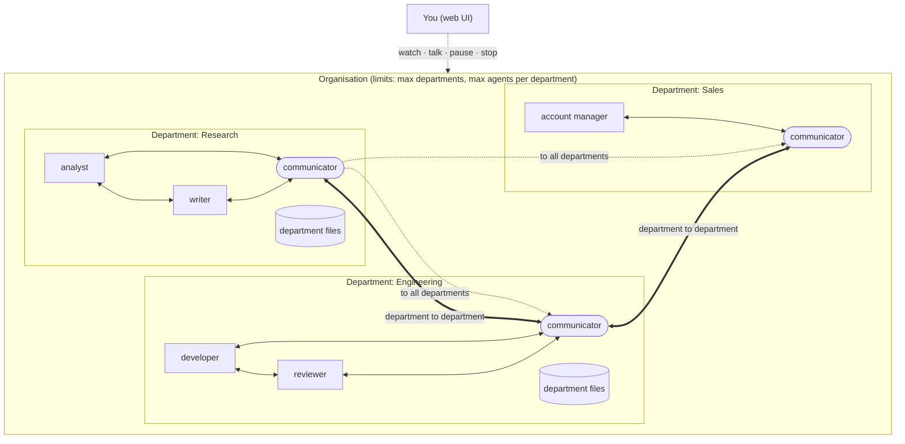
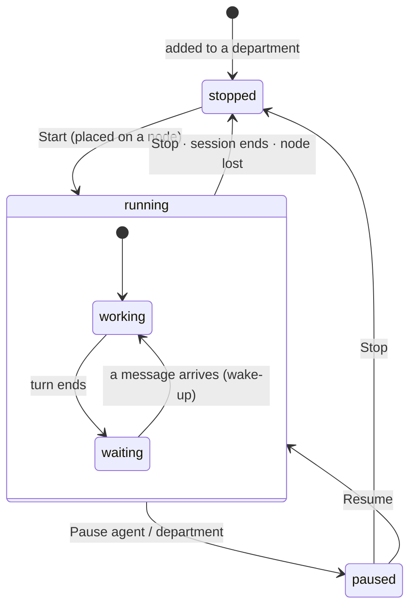
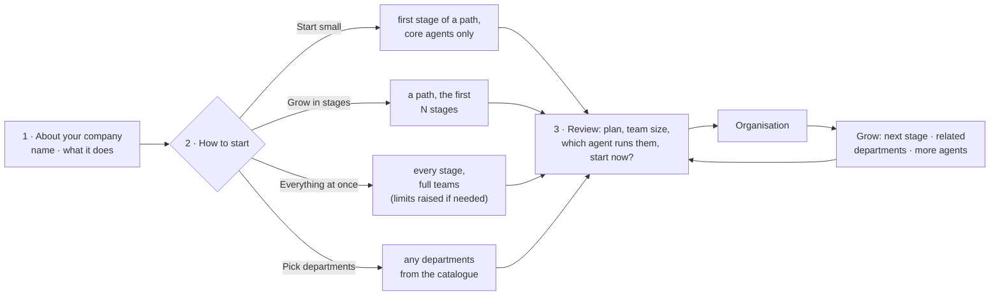
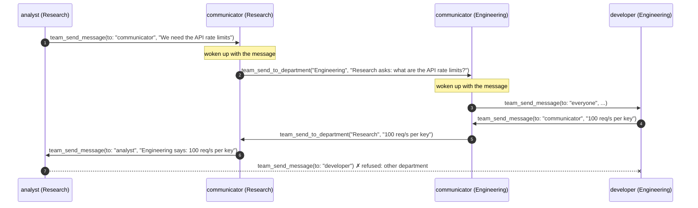
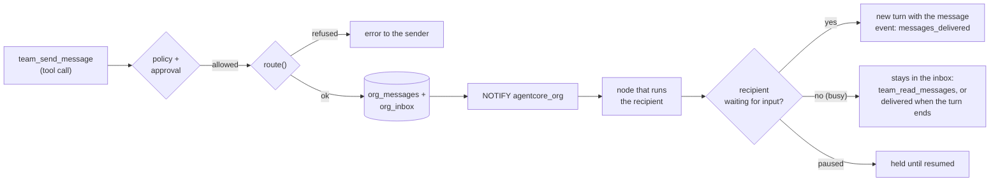
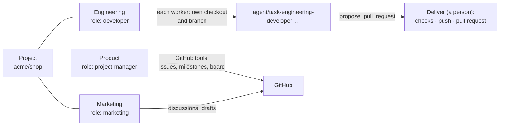
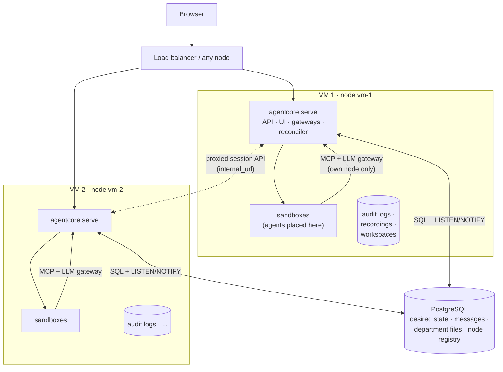
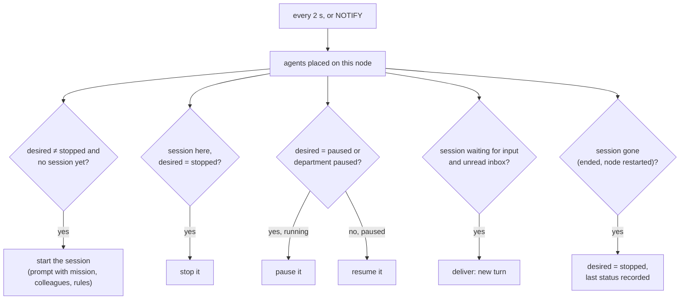
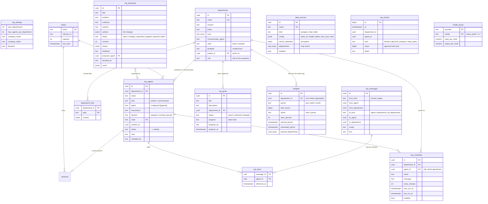

# Multi-agent organisations

agentcore can run many agents together as an **organisation** made of
**departments** (a department is a "room"). Each department has its own
mission, data, tools and guardrails. Agents in the same department work
together. Departments talk to each other only through their
**communicator** agents. People can open any department and any agent, see
everything that happens, talk to any agent, and pause or stop one agent, a
department or the whole organisation.

An organisation can run on one VM or be spread over several VMs (**nodes**)
that share one PostgreSQL database.

- [Concepts](#concepts)
- [Building an organisation](#building-an-organisation)
- [Writing your own templates](#writing-your-own-templates)
- [Who may talk to whom](#who-may-talk-to-whom)
- [Messages](#messages)
- [Data, tools and guardrails per department](#data-tools-and-guardrails-per-department)
- [Working on a repository](#working-on-a-repository)
- [Goals, check-ins and agents that keep going](#goals-check-ins-and-agents-that-keep-going)
- [Business data](#business-data)
- [Metrics, the retrospective and improvements](#metrics-the-retrospective-and-improvements)
- [Spending and budgets](#spending-and-budgets)
- [Human oversight](#human-oversight)
- [Limits](#limits)
- [Running on several VMs](#running-on-several-vms)
- [Data model](#data-model)
- [API](#api)
- [Configuration](#configuration)
- [What is not there yet](#what-is-not-there-yet)

## Concepts



| Concept | What it is |
|---|---|
| **Organisation** | Every department on this agentcore installation, across all nodes. |
| **Department** (room) | A group of agents with a mission, its own data (department files, sandbox workspaces), its own tool set and its own guardrail policy. |
| **Worker agent** | A member of one department that does the department's work. It may talk to everyone in its department, including the communicator. |
| **Communicator agent** | Exactly one per department, created with the department. It has *only* messaging tools: no sandbox commands, no file access, no department files. It passes messages between its department and other departments. |
| **Node** | One agentcore process (usually one VM) that runs agent sandboxes. All nodes share PostgreSQL. |

Every agent is a normal agentcore session underneath: it runs in its own
sandbox, every action goes through policy and possibly a human approval, it
has a hash-chained audit log, a live view and a recording. The organisation
adds membership, messaging and coordinated control on top.

An agent's life:



## Building an organisation

Nobody has to design an organisation from scratch. agentcore ships
**department templates** for the functions businesses usually need and
**growth paths** (blueprints) that add them a few at a time. Everything
created from a template is an ordinary department afterwards: rename it,
change its mission, add or remove agents.



### The catalogue

29 department templates in five groups (`templates/departments/*.toml`):

| Group | Departments |
|---|---|
| Product & engineering | Engineering, Quality Assurance, Platform & DevOps, Security, Product, Design, Data & Analytics, AI & Machine Learning, Technical Writing, Internal IT |
| Growth | Marketing, Content, Sales, Partnerships, Communications & PR, Community |
| Customers | Customer Support, Customer Success |
| Operations | Operations, Finance, Legal & Compliance, People & HR, Recruiting, Procurement, Supply Chain & Logistics |
| Leadership | Strategy & Leadership, Project Management, Market Research, Retrospective |

Each template has a mission (`{company}` is replaced with the company
name), the tools it needs (engineering-type departments get a sandbox;
business departments get department files), the departments it usually
works with, a "when to add it" hint, and 1–3 agents with instructions. Agents
marked `core` form a **lean** team; a **full** team has all of them.

### Growth paths

| Path | For | Stages |
|---|---|---|
| Solo software engineer | one person building software | Engineering → QA → DevOps, Docs |
| Content & marketing studio | creators, small marketing teams | Content, Marketing → Design, PR, Community → Data, Sales |
| Software product team | a product team | Engineering, Product → Design, QA → DevOps, Security → Data, Docs |
| SaaS startup | a software business | Engineering, Product → Marketing, Support → Sales, Success, Data → Finance, Legal, People |
| Online shop | physical products online | Operations, Marketing, Support → Content, Data, Supply chain → Finance, Procurement, Legal |
| Agency / services company | client projects | Projects, Engineering, Design → Sales, Marketing → Finance, Legal, People |
| Complete company | everything from day one | 5 stages, 27 departments |

### Starting small, growing big

* **Start small**: the first stage of a path with lean teams, e.g. a single
  Engineering department with a tech lead and a developer.
* **Grow in stages**: choose how many stages to create now.
* **Everything at once**: a whole path with full teams. If it does not fit
  the limits, the review says by how much and an admin can raise them in the
  same step.
* **Pick departments**: tick departments in the catalogue.

Afterwards the organisation page shows **suggestions**, most useful first:

1. the **next stage** of the chosen path;
2. **departments that work with the ones you have** (Engineering suggests
   Product, QA, DevOps, Design), with the reason to add them;
3. **more agents** for existing departments (a reviewer for Engineering).

Each one is a click away, and a suggestion that a limit blocks says so.
Admins build departments; operators can add the suggested agents; viewers
see the suggestions.

Teams add their own templates and paths by adding TOML files to
`templates/` (`[templates].dir`); they are validated at startup. See
[Writing your own templates](#writing-your-own-templates).

The company name and description (set in the builder, or with
`PUT /api/v1/org/profile`) are given to every agent at the top of its first
prompt, and `{company}` in template texts is replaced with the name.

## Writing your own templates

Department templates live in `templates/departments/*.toml`; each file holds
any number of `[[departments]]`:

```toml
[[departments]]
id = "engineering"                # unique; blueprints and pairs_with refer to it
name = "Engineering"              # name of the department when created
category = "build"                # build | grow | serve | run | lead
summary = "Designs, builds and maintains the software."
when_to_add = "First, if {company} builds software."   # shown in suggestions
tools = ["sandbox", "files"]      # sandbox and/or files; messaging is always on
policy = "department"             # optional; default: the `department` policy
pairs_with = ["product", "qa"]    # suggested once this department exists
mission = """Build and maintain {company}'s software. ..."""

[[departments.agents]]
name = "lead"                     # a-z 0-9 - _, how colleagues address it
title = "Tech lead"
core = true                       # part of a lean team (at least one per template)
instructions = """..."""
```

Blueprints (growth paths) are one file each in `templates/blueprints/`:

```toml
id = "solo-developer"
title = "Solo software engineer"
level = "starter"                 # starter | growing | complete
focus = "software"                # free text, shown to people
audience = "You build software on your own and want AI colleagues to help."
description = "..."

[[stages]]
title = "Your engineering department"
description = "A tech lead and a developer."
departments = ["engineering"]     # template ids; each at most once per blueprint
```

agentcore refuses to start if a template is invalid: duplicate ids, an
unknown category, tool group, policy or referenced template, an invalid or
duplicate agent name, or a template without a `core` agent. Templates are
only a starting point: departments created from them can be changed freely
and are not updated when the template changes.

## Who may talk to whom

Routing is decided by one pure function (`agentcore_core::org::route`), used
for every message, from agents and from people alike, and unit tested rule by
rule.

| From ↓ / To → | worker, same dept | own communicator | own department room | worker, other dept | communicator, other dept | other department | all departments |
|---|---|---|---|---|---|---|---|
| **Worker** | ✅ | ✅ | ✅ | ❌ | ❌ | ❌ | ❌ |
| **Communicator** | ✅ | – | ✅ | ❌ | ✅ | ✅ (to its communicator) | ✅ (to every other communicator) |
| **Human** | ✅ | ✅ | ✅ | ✅ | ✅ | ✅ | ✅ |

A refused message is not stored or delivered. The agent gets an error that
explains the rule ("ask your department's communicator").



## Messages

Messages are rows in PostgreSQL: the sender, the addressee (an agent, a
department room, or all departments), the scope (`internal`,
`inter_department`, `human`) and the text. When a message is sent, its
recipients are resolved once and an **inbox** entry is written per recipient:

| Addressed to | Recipients |
|---|---|
| an agent | that agent |
| own department room (from a member or a person) | everyone in the department except the sender |
| another department (communicator) | that department's communicator |
| all departments (communicator) | the communicators of all other departments |

Delivery to an agent:



* Sending is a tool call, so it goes through the department's policy like any
  other action: a policy can, for example, require a human to approve every
  message that leaves the department (`team_send_to_department`).
* Delivery is recorded in the recipient's audit log
  (`messages_delivered`, with message ids, senders and texts), so each agent's
  hash chain shows what it was told and by whom.
* An agent that can continue a conversation (opencode, CLI agents with
  `follow_up_args`) waits after each turn and is woken by new messages.
* Loops between agents are bounded by the policy limits of each session
  (`max_actions`, `max_model_calls`, `max_session_secs`).

### Agent tools

| Tool | Worker | Communicator | Purpose |
|---|---|---|---|
| `team_list_colleagues` | ✅ | ✅ | Members of the own department, their status, and the names of the other departments. |
| `team_send_message` | ✅ | ✅ | `to`: a colleague's name, `communicator` or `everyone` (the department room). |
| `team_read_messages` | ✅ | ✅ | Unread messages from the inbox (marks them delivered). |
| `team_send_to_department` | ❌ | ✅ | `department`: a department name or `all`. |
| `team_list_files`, `team_read_file`, `team_write_file` | if the department grants `files` | ❌ | The department's shared files. |
| `team_list_goals` | ✅ | ❌ | The organisation's goals with their latest progress. |
| `data_list_sources`, `data_query` | if the department was granted a data source | ❌ | Read-only business data (see [Business data](#business-data)). |
| `insights_metrics`, `insights_org`, `insights_messages`, `insights_proposals`, `insights_propose`, `insights_revise` | if the department grants `insights` | ❌ | The retrospective: metrics, structure, messages, and proposals (see [below](#metrics-the-retrospective-and-improvements)). |
| `team_report_progress` | ✅ | ❌ | `goal` (id or title), `text`: replaces the goal's latest progress note. |
| `run_command`, `read_file`, `write_file`, `list_files` | if the department grants `sandbox` | ❌ | Commands and files in the agent's own sandbox. |

The tool list an agent sees *is* its permission: a tool that is not offered is
also refused if called.

## Working on a repository

A department can work on a **project**: a GitHub repository set up under
Projects (see [Ways of working](WAYS_OF_WORKING.md)). Link it when creating
or editing the department, or choose the repository in the builder: then
every new department whose template has a role on a repository is linked.



What a worker in a linked department gets:

| | With the `sandbox` tool group | Without |
|---|---|---|
| Checkout | Its own clone of the repository (base branch from the project) on its own branch `agent/task-<department>-<agent>-<id>`, prepared on the host before the agent starts, exactly as for project sessions | none |
| GitHub tools | Those of the department's role (default: the project's role): developer → read issues, comment, propose a pull request; project-manager → manage issues, milestones and the board; marketing → discussions | same |
| First prompt | The role's playbook, the team's convention files from the repository (`CONTRIBUTING.md`, `AGENTS.md`, ...), the project's notes, the role's checks, then the department part (mission, colleagues, the repository and how to deliver) | the role's playbook and the project's notes, then the department part |
| Delivery | When the agent proposes a pull request, a person clicks **Deliver** in its session: the role's checks run, the branch is pushed with agentcore's GitHub credentials, the pull request is opened | – |

Communicators never get the repository. Nothing reaches GitHub without
passing the department's policy: GitHub writes need approval under the
`department` and `default` policies, and code only leaves the sandbox
through a delivery a person starts. Department templates for code-heavy
functions (Engineering, QA, DevOps, Security, Data, AI/ML, Technical
Writing) use the `default` policy, which allows the usual development tools
in the sandbox.

Each new session of an agent starts from a fresh checkout of the base
branch on a new branch, so work should be delivered before a session ends
(see the session limits in the policy).

## Goals, check-ins and agents that keep going

An organisation can work towards goals over days and weeks without a person
writing to it every time. Three things make that possible.

**Goals.** People set the organisation's goals ("Reach 10 paying customers
by March"), optionally owned by one department. Every agent sees the active
goals in its prompt; workers read them with `team_list_goals` and report
progress with `team_report_progress` (the latest note, who wrote it and when
are shown with the goal). Only people mark a goal *achieved* or *dropped*.

**Check-ins.** A check-in is a message sent on a schedule (every hour, day,
week, ...) to one agent or to everyone in a department, from
`check-in: <name>`. It wakes sleeping agents and tells them what to do, for
example the daily check-in: *"Read the goals, your notes and new messages.
Decide the most valuable next step towards the goals, do it, update your
notes, and report progress."* Every node runs the scheduler; each due
check-in is claimed by exactly one node (row lock with `SKIP LOCKED`), so it
is sent once. A check-in that was due several times while nothing ran (all
nodes down) is sent once and continues from now. People can run a check-in
now, turn it off, or delete it.

**Sleep, wake and continue.** An agent started by a person stays wanted
(`desired = running`) until a person stops it. When its session ends:

| The session ended because | The agent |
|---|---|
| nobody wrote to it within `idle_timeout_secs`, or a single-run agent finished | **sleeps** (`status = asleep`): no session, no sandbox, no cost. The next message (from a colleague, a person or a check-in) wakes it in a fresh session with the messages in its prompt. |
| it reached `max_session_secs` | **continues** at once in a fresh session (in a paused department: sleeps until resumed). |
| a person stopped it, it failed, ... | is stopped, as before. |

A fresh session starts from the agent's notes: workers with department files
keep `notes/<agent>.md` (what they are working on, decisions, next steps),
and the prompt of a continued or woken session says *"You are continuing"*
and asks the agent to read its notes and recent messages first. On a linked
repository it gets a fresh checkout on a new branch, so agents are told to
deliver work before a session ends. Sleeping agents survive a node restart
(they have nothing running); pausing or stopping works on them as on any
agent.

To stop a loop (an agent that ends at once and is woken again, two agents
waking each other), a node starts one agent automatically at most 6 times an
hour; after that the agent is stopped with a note. Starting it by hand
resets the count. Time budgets, model-call limits and the policy still apply
to every session.

The builder can set both up: *A goal for the organisation* creates the first
goal, and *Keep it running* adds a daily check-in for the lead of each new
department and a weekly review in Strategy.

## Business data

Departments that steer the company need facts: revenue, sign-ups, usage,
support tickets. An admin adds **data sources** under *Organisation →
Business data* and ticks the departments that may read each one:

| Kind | What agents do | Configure |
|---|---|---|
| **Table** | read an uploaded CSV with `filter` (`{column: value}`), `contains`, `columns`, `limit`, `offset` | the file (≤ 5 MB, first row = column names) |
| **PostgreSQL** | run one `SELECT` (`sql`) | a connection string, ideally of a user that can only read |
| **HTTP API** | `GET` a `path` below the base URL | base URL, header name and value (e.g. `Authorization: Bearer …`), optional allowed path prefixes, a path for *Try it* |

Workers of a granted department get `data_list_sources` and `data_query`,
and their prompt lists the sources with their descriptions. Guarantees:

* **Read-only.** SQL runs in a `READ ONLY` transaction with a 15 s statement
  timeout, one statement only, wrapped so at most `max_rows` (default 200,
  at most 1000) rows come back; the transaction is rolled back. HTTP
  sources only `GET`, never follow redirects (the key cannot be sent
  elsewhere) and return at most 256 KB. Tables are read in memory.
* **Secrets stay on the server.** Connection strings and API keys are
  encrypted with the master key (like provider keys) and never shown to
  agents or in the API (only a hint like `…ales`).
* **Grants are checked on every call**, so taking a department off a source
  (or turning the source off) takes effect at once.
* **Every query is recorded** (`org_activity`, kind `data_query`) and shows
  up in the metrics; the tool call itself is in the session's audit log.

Admins can *Try it* with their own query before granting a source.

## Metrics, the retrospective and improvements

### Metrics

*Organisation → Dashboard* shows how the organisation did over the last 7,
14 or 30 days, all measured from what agents did:

* figures: agents working and asleep, agent-hours (time sessions ran),
  tokens and model calls, messages (and between departments), the average
  wait until a message reached its recipient, goals with progress, applied
  improvements;
* per day: sessions, messages, tokens, model calls, failed sessions, denied
  actions;
* per department and per agent: sessions, failures, agent-hours, tokens,
  messages sent and received, waiting messages, denied actions, approvals
  and how long they waited, progress reports, data queries, last activity;
* goals: on track, slowing (no progress for a week) or stalled (two weeks).

Sessions, model calls and messages come from their tables; denied actions,
approvals (with their waiting time), goal progress reports and data queries
are recorded in `org_activity` as they happen. `GET /org/metrics?days=`
returns the same numbers.

### Signals

Patterns that usually mean waste are listed first, most severe first, each
with what usually helps:

| Signal | When |
|---|---|
| messages pile up | ≥ 5 messages wait in a department whose agents are all stopped |
| failing agent | ≥ 2 failed sessions and at least half of its sessions |
| stale goal | an active goal without progress for 7 days (high after 14) |
| idle department | workers, but no sessions, no messages and no check-in in the period |
| slow responses | messages wait more than an hour on average |
| policy mismatch | ≥ 5 denied actions in a department |
| slow approvals | approvals wait more than an hour on average |
| spend without output | an agent used > 200K tokens or > 8 agent-hours but sent no messages |

*Ask for a fix* sends the signal to the retrospective agent.

### The retrospective

A department granted the **`insights`** tool group (the *Retrospective*
template: one agent, `retro`, and a daily check-in) watches the whole
organisation. Its workers can read the metrics and signals
(`insights_metrics`), the structure with ids, policies and agents
(`insights_org`), any department's messages (`insights_messages`) and the
proposals (`insights_proposals`). They change nothing themselves: they
**propose** (`insights_propose`) with

* the **problem** (what is inefficient), the **evidence** (numbers), the
  **solution**,
* and the **changes** that apply it, from a closed set:

| Change | Fields | Needs |
|---|---|---|
| `update_instructions` | `agent`, `instructions` | operator |
| `control_agent` | `agent`, `control` (`start`/`pause`/`resume`/`stop`) | operator |
| `create_check_in` | `department`, `agent`?, `name`, `message`, `every_minutes` | operator |
| `update_check_in` | `check_in`, `message`?, `every_minutes`?, `enabled`? | operator |
| `create_goal` | `title`, `description`?, `department`? | operator |
| `send_message` | `department` or `agent`, `text` | operator |
| `set_budget` | `department`?, `period` (`day`/`week`/`month`), `limit` (currency), `action` (`warn`/`pause`) | admin |
| `add_agent` | `department`, `name`, `agent`?, `instructions` | admin |
| `remove_agent` | `agent` (stopped first) | admin |
| `update_department` | `department`, `mission`?, `policy`?, `tools`? | admin |
| `set_limits` | `max_departments`?, `max_agents_per_department`? | admin |

References are checked when the proposal is made and again when it is
applied.

### Deciding

*Organisation → Improvements* lists the proposals. For each, a person can:

* **Apply** it: the changes run in order, in the name and with the
  permissions of that person (a viewer cannot apply; admin-only changes
  need an admin). The first change that fails stops the rest; the result
  of each change is shown. Applying names the revision the person reviewed,
  so a proposal revised in the meantime is not applied by surprise (`409`),
  and two people applying at once apply it once.
* **Change it**: edit the texts and the changes; it becomes a new revision
  (the old one is kept in the history), then apply it.
* **Send it back** with what should change: the proposer gets a message,
  wakes up and revises it (`insights_revise`).
* **Reject** it, with a reason the proposer is told so it does not propose
  it again.

The proposer is told when its proposal is applied (or a change failed), so
it can check in the metrics whether the change helped.

**Apply without asking.** An admin can tick kinds of change (for example
*Add a goal*, *Change a check-in*) under *Apply without asking*. A proposal
from an agent whose changes are all of ticked kinds is applied at once, in
the name of "auto-apply (allowed by <admin>)". Everything else waits for a
person.

## Spending and budgets

*Organisation → Spending* shows what model calls cost and limits it.

**Prices.** An admin sets the price per million input and output tokens per
provider and model: an exact model name, a prefix ending in `*`
(`claude-sonnet-*`), or `*` for every model of the provider; the most
specific price wins. Every call through the model gateway is **priced when
it is recorded** (`model_calls.cost_micros`, millionths of the currency), so
a later price change does not rewrite history. Calls made before a price
existed can be priced afterwards (*Price them with the current prices*).
The currency is a label set once (default `USD`).

**Budgets.** A budget limits the spending of the whole organisation or one
department per calendar day, week (from Monday) or month, in UTC. Each
scope has at most one budget per period; setting it again replaces it.

| | `warn` | `pause` |
|---|---|---|
| At `warn_percent` (default 80 %) | people see a warning on the dashboard | the same |
| At the limit | people see it was used up | the departments in scope are **paused** (marked as paused by the budget) and the model gateway **refuses** their calls with `403` and the reason |
| Next period, or a higher limit | — | the departments the budget paused are resumed (unless a person changed them since) and calls go through |

Each node checks budgets on its heartbeat (every `heartbeat_secs`); each
step (warn, pause, resume) is claimed by exactly one node. The gateway reads
the usage with at most 5 seconds of delay, so the calls in flight when a
limit is reached can take the spending slightly over it. Resuming a paused
department by hand does not lift the block: raise the limit or wait for the
next period.

Agents covered by a budget see it in their prompt (*Budget: 2.10 of 5.00
EUR used this month*) and are asked to work economically. Costs appear per
day, department and agent on the dashboard, and the retrospective sees them
too: it can propose a `set_budget` change (admin to apply), and signals warn
when a budget is nearly or fully used, or when tokens are used without
prices.

## Data, tools and guardrails per department

| | Set per department | Enforced by |
|---|---|---|
| **Mission** | Text given to every agent of the department in its first prompt. | Prompt |
| **Tools** | `sandbox` (commands and files in the agent's own sandbox), `files` (department files) and/or `insights` (the organisation's metrics and proposing improvements). Messaging is always available. | Tool gateway (`tools/list` and `tools/call`) |
| **Data** | Department files: a small shared file store (PostgreSQL, so every node sees it) that only that department's workers can read and write. Each worker also has its own sandbox workspace. [Business data](#business-data) sources granted to the department, read-only. | Gateway: the department is taken from the agent's identity, never from tool arguments |
| **Guardrails** | A policy (allow / deny / require approval, limits) for its workers. Communicators use the `communicator` policy. | Policy engine, per action |
| **Agent kind** | Which configured `[[agents]]` (e.g. `opencode`) each member runs, plus member-specific instructions. | Runtime |

The communicator has no sandbox tools, no file tools and a policy that only
allows the `team_*` messaging tools.

## Human oversight

Everything a person can do, at every level:

| | Agent | Department | Organisation |
|---|---|---|---|
| **See** | Live view, timeline, model calls, approvals, audit log (the existing session view) | Room: all members with status, every message in and out, department files | Overview: all departments, all agents, node health, organisation-wide message feed |
| **Talk** | Message an agent (wakes it) | Post in the department room (every member receives it) | Message any department |
| **Pause / resume** | ✅ | ✅ every agent in it, and new starts wait | ✅ (`Pause all`) |
| **Stop** | ✅ | ✅ every agent in it | ✅ **Stop all agents** (on every node) |

Pause and stop are recorded with who did it, in the audit log of every
affected agent and in the admin log.

## Limits

An admin sets, in the UI (Organisation → Limits) or with
`PUT /api/v1/org/settings`:

* `max_departments`: how many departments may exist;
* `max_agents_per_department`: how many worker agents a department may
  have (its communicator is not counted).

They are checked inside the same database transaction that creates the
department or agent (with a row lock on the settings), so two people adding
agents at the same time on different nodes cannot exceed them. Lowering a
limit does not remove anything; it only blocks new additions. In addition,
each node has a capacity (`[cluster].max_agents`): the number of agents it
runs at the same time.

## Running on several VMs

Every VM runs the same `agentcore serve` binary with its own
`[cluster].node_name`. All nodes use one PostgreSQL database. There is no
separate control-plane process: any node can serve the web UI and the API.



### Principles

1. **PostgreSQL holds the desired state; nodes converge to it.** Starting,
   pausing and stopping an agent or a department only *writes* what should be
   true (`org_agents.desired`, `departments.state`). Each node runs a
   **reconciler** that compares that with the sessions it runs and acts.
   A `NOTIFY agentcore_org` wakes every node's reconciler at once; a periodic
   pass (every 2 s) catches anything a dropped connection missed. So commands
   are level-triggered: a missed notification delays a command, it never loses
   it.
2. **A session is owned by exactly one node**, the one it was placed on. Its
   sandbox, audit log, recording and the agent's gateways live there. The
   agent only ever talks to its own node.
3. **Any node answers any request.** Session endpoints
   (`/api/v1/sessions/{id}/...`: details, events, live view, pause, stop,
   approvals, audit) are forwarded to the owning node's `internal_url`,
   including streams (SSE). The caller's token is forwarded and checked again
   by the owner, so every node needs the same `[[server.operators]]`.

### Placement

When an agent is started, the node handling the request picks a node inside
one transaction (with an advisory lock, so concurrent starts do not
overbook): among nodes whose heartbeat is fresh, the one with the lowest
load = running agents ÷ `max_agents`, skipping full nodes. No free node →
`503`. The agent row records the node; only that node's reconciler starts the
session.

### Reconciler (per node)



### Failure handling

| What fails | What happens |
|---|---|
| A node crashes or loses the database | Its heartbeat goes stale (`node_timeout_secs`). Any other node marks that node's agents `stopped` (status `failed`, "node lost"). Their sandboxes died with the node; agents are not silently restarted elsewhere, because their workspace state is gone. A person starts them again. |
| A node restarts | Its interrupted sessions are closed in their audit logs (`session_ended`, interrupted) and its leftover sandboxes are removed. Only its *own* sessions: other nodes' live sessions are untouched. |
| A NOTIFY is lost | The periodic reconcile pass applies the change within 2 s. |
| The owning node is unreachable when a session page is opened | `503 node <name> is unreachable`; the organisation views (served from PostgreSQL) keep working. |
| Stop all agents | Writes `desired = stopped` for every agent and broadcasts `stop_all`; every node also stops sessions that do not belong to an organisation. |

### Security between nodes

* Nodes talk to each other only to forward session API calls, to
  `internal_url`, which should be on a private network. The forwarded request
  carries the operator's own token; the owner authenticates it again.
* Agents never reach another node: their gateway URL and token are those of
  their own node.
* PostgreSQL is the trust anchor: whoever can write to it can direct agents.
  Use TLS and a dedicated database user.
* `data/master.key` (or `$AGENTCORE_MASTER_KEY`) must be the same on every
  node, so each node can decrypt provider keys.

### Sizing

PostgreSQL `LISTEN/NOTIFY` and the 2 s reconcile pass are cheap at the scale
the limits allow (tens of departments × tens of agents). Payloads are only
nudges (`{"kind":"message","agents":[...]}`); the data is read with
indexed queries. The bus is one module (`cluster.rs`), so a dedicated broker
(NATS, Redis streams) can replace it if organisations grow far beyond that.

## Data model



## API

All under `/api/v1`; reading needs a viewer, changing an operator, settings
an admin.

| Method & path | What |
|---|---|
| `GET /org` | Overview: settings, departments with their agents, goals, check-ins, nodes. |
| `GET /org/stream` | SSE of change notifications (`agents`, `department`, `message`, `files`, `settings`, `goals`, `checkins`, `proposals`, `data_sources`, `budget`, `stop_all`, `resync`); clients refetch what changed. |
| `GET`/`POST /org/goals` | Goals; create `{"title", "description", "department_id"?}` (operators). |
| `PUT`/`DELETE /org/goals/{id}` | Change `title`, `description`, `department_id` (`null` clears it), `status` (`active`\|`achieved`\|`dropped`); delete. |
| `POST /org/goals/{id}/progress` | A person records progress: `{"text"}`. |
| `GET`/`POST /org/departments/{id}/checkins` | Check-ins of a department; create `{"name", "message", "every_minutes", "agent_id"?, "first_run_at"?}` (operators; default first run: one interval from now). |
| `PUT`/`DELETE /org/checkins/{id}` | Change `name`, `message`, `every_minutes`, `enabled`; delete. |
| `GET /org/metrics?days=` | Metrics of the last `days` (1–365, default 14), budgets, currency and signals. |
| `GET /org/spending?days=` | Currency, prices, budgets with their usage this period, calls without a price. |
| `PUT /org/prices` · `DELETE /org/prices?provider=&model=` | Set `{"provider", "model", "input_per_mtok", "output_per_mtok"}`; delete (admin). |
| `POST /org/prices/backfill` | Price recorded calls that have no price yet (admin). |
| `PUT /org/currency` | `{"currency": "EUR"}` (admin). |
| `POST /org/budgets` · `PUT`/`DELETE /org/budgets/{id}` | Set `{"department_id"?, "period", "limit_micros", "action", "warn_percent"?}` (replaces the one for that scope and period); change `limit_micros`, `action`, `warn_percent`; delete (resumes what it paused). Admin. |
| `GET`/`POST /org/proposals?status=` | Proposals; a person writes one: `{"title", "problem", "evidence", "solution", "actions"}` (operators). |
| `GET`/`PUT /org/proposals/{id}` | One proposal; a person changes it (`title`, `problem`, `evidence`, `solution`, `actions`, `note`) as a new revision. |
| `POST /org/proposals/{id}/apply` | Apply `{"revision"}` (operators; admin-only changes need an admin; `409` if it was revised or decided). |
| `POST /org/proposals/{id}/changes` · `reject` | Send back `{"text"}` (the proposer revises) or reject with a reason. |
| `GET`/`PUT /org/auto-apply` | Kinds of change applied without asking: `{"kinds": [...]}` (admin to change). |
| `GET`/`POST /org/data-sources` | Business data sources (no secrets); create `{"name", "kind", "description", "config", "secret"?, "content"?, "departments"}` (admin). |
| `PUT`/`DELETE /org/data-sources/{id}` | Change `description`, `config`, `secret` (`""` removes it), `content`, `departments`, `enabled`; delete (admin). |
| `POST /org/data-sources/{id}/test` | Try a read (admin); optional body with `sql`, `path` or `filter`. |
| `POST /org/checkins/{id}/run` | Send it now (`409` when turned off); the schedule continues from now. |
| `GET`/`PUT /org/settings` | Limits (admin). |
| `POST /org/departments` | Create a department (and its communicator): `{"name", "description", "mission", "policy", "tools", "communicator_agent", "project_id"?, "role"?}`. |
| `PUT`/`DELETE /org/departments/{id}` | Update; delete (only when all its agents are stopped). |
| `POST /org/departments/{id}/agents` | Add a worker agent. |
| `PUT`/`DELETE /org/agents/{id}` | Update instructions; remove (when stopped). |
| `POST /org/agents/{id}/start` · `pause` · `resume` · `stop` | Control one agent. |
| `POST /org/departments/{id}/start` · `pause` · `resume` · `stop` | Control every agent in a department. |
| `POST /org/pause-all` · `resume-all` | Pause or resume every department. |
| `POST /stop-all` | Stop everything, on every node. |
| `GET /org/messages?department=&agent=&after=&limit=` | Message feed (organisation, department or agent). |
| `POST /org/messages` | A person sends a message: `{"to": {"agent": id} \| {"department": id} \| "all_departments", "text": ...}`. |
| `GET /org/departments/{id}/files` · `GET`/`PUT /org/departments/{id}/files/{*path}` | Department files (`PUT` body `{"content": ...}`, operators). |
| `GET /org/templates` | Template categories, department templates and blueprints. |
| `GET`/`PUT /org/profile` | Company name and description, chosen blueprint (admin to change). |
| `GET /org/suggestions` | What to add next: the blueprint's next stage, related departments, more agents; `blocked` says when a limit prevents it. |
| `POST /org/build` | Create departments from templates (admin): `{"profile", "departments": [ids], "size": "lean"\|"full", "agent", "communicator_agent", "project_id", "goal", "check_ins", "start", "raise_limits", "dry_run"}`; `goal` creates a first goal, `check_ins` a daily check-in per new department (and a weekly review in Strategy); with `project_id`, new departments whose template has a role are linked to that project. Existing departments are skipped; a plan over the limits is refused with `409` (body has the plan) unless `raise_limits`. |

## Configuration

```toml
[cluster]
node_name = "vm-1"                       # unique per node (default: hostname)
internal_url = "http://10.0.0.11:8080"   # how other nodes reach this one
max_agents = 20                          # agents this node runs at once
heartbeat_secs = 5
node_timeout_secs = 30
reconcile_millis = 2000                  # periodic reconcile pass

[templates]
dir = "templates"                        # departments/*.toml, blueprints/*.toml

[org]
communicator_policy = "communicator"     # policy for every communicator
default_max_departments = 10             # initial limits (then set in the UI)
default_max_agents_per_department = 10
```

A single-VM installation needs no `[cluster]` section. Step-by-step setup of
several VMs: [Deployment](DEPLOYMENT.md#several-vms).

## What is not there yet

* Check-ins at a time of day (cron-like); today they run every N minutes
  from when they were created or last run.
* Prices are entered by hand; they are not fetched from providers.
* Ready-made connectors for popular services (Stripe, Plausible, ...): today
  they are added as HTTP sources.
* Moving a running agent between nodes (live migration of a sandbox).
* Per-department model providers.
* A dedicated message broker for very large organisations.
