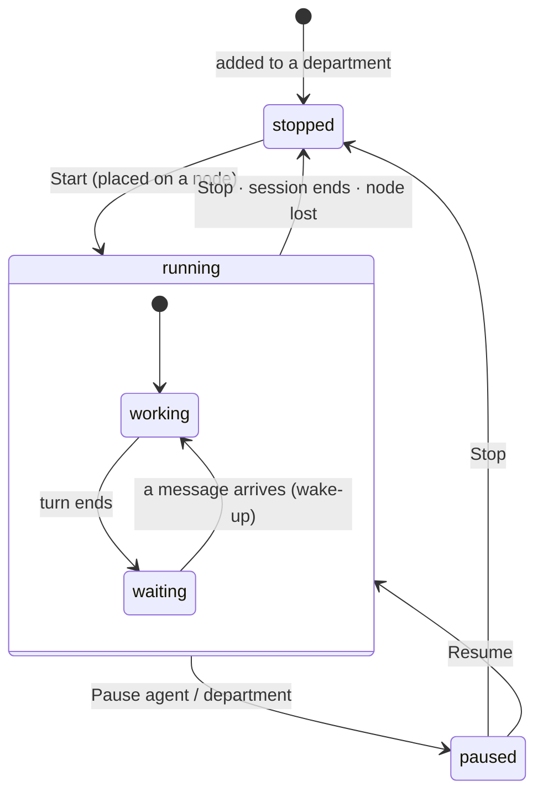
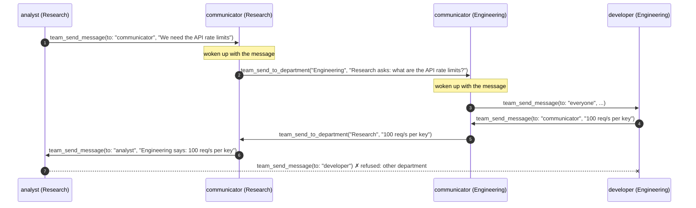
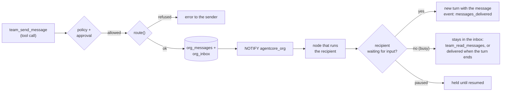
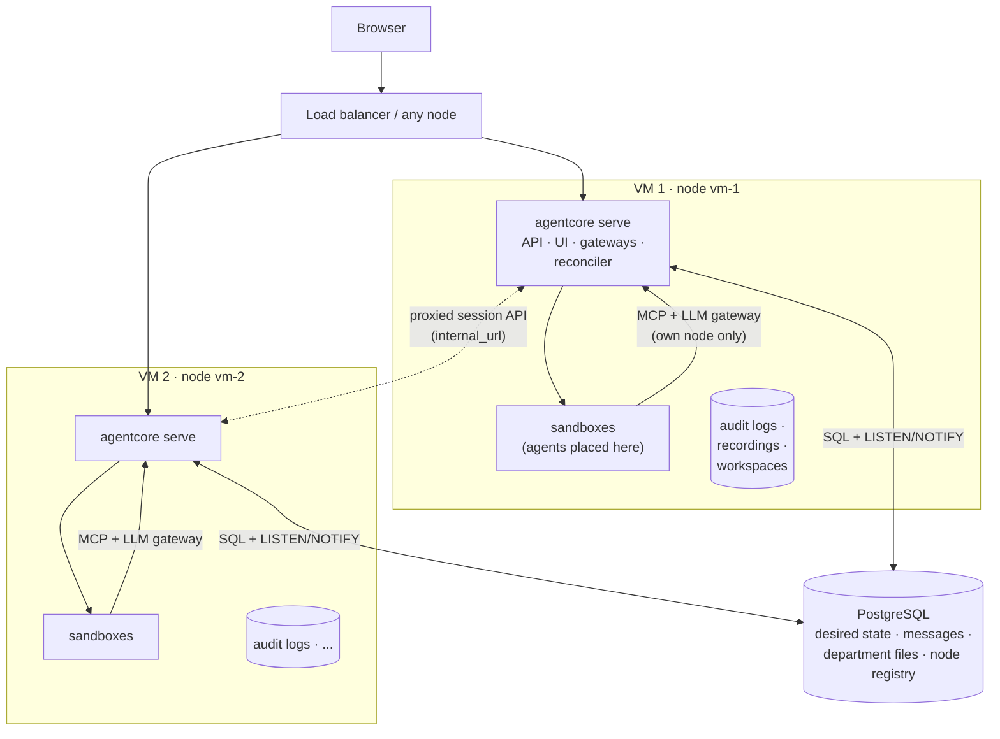
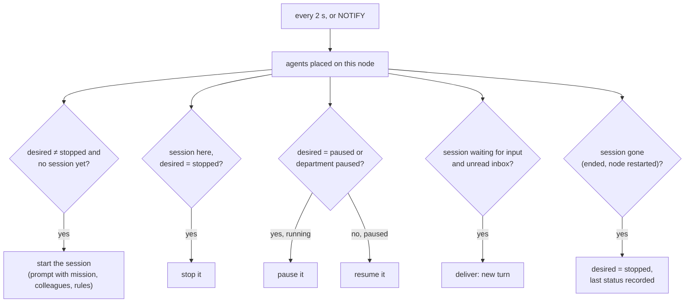
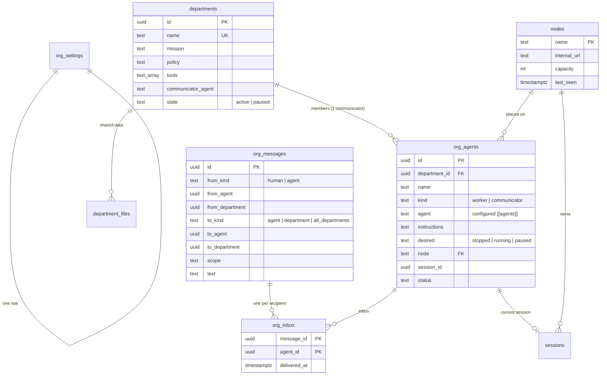

# Multi-agent organisations

agentcore can run many agents together as an **organisation** made of
**departments** (a department is a "room"). Each department has its own
mission, data, tools and guardrails. Agents in the same department work
together. Departments talk to each other only through their
**communicator** agents. People can open any department and any agent, see
everything that happens, talk to any agent, and pause or stop one agent, a
department or the whole organisation.

An organisation can run on one VM or be spread over several VMs (**nodes**)
that share one PostgreSQL database.

- [Concepts](#concepts)
- [Who may talk to whom](#who-may-talk-to-whom)
- [Messages](#messages)
- [Data, tools and guardrails per department](#data-tools-and-guardrails-per-department)
- [Human oversight](#human-oversight)
- [Limits](#limits)
- [Running on several VMs](#running-on-several-vms)
- [Data model](#data-model)
- [API](#api)
- [Configuration](#configuration)
- [What is not there yet](#what-is-not-there-yet)

## Concepts


| Concept | What it is |
|---|---|
| **Organisation** | Every department on this agentcore installation, across all nodes. |
| **Department** (room) | A group of agents with a mission, its own data (department files, sandbox workspaces), its own tool set and its own guardrail policy. |
| **Worker agent** | A member of one department that does the department's work. It may talk to everyone in its department, including the communicator. |
| **Communicator agent** | Exactly one per department, created with the department. It has *only* messaging tools: no sandbox commands, no file access, no department files. It passes messages between its department and other departments. |
| **Node** | One agentcore process (usually one VM) that runs agent sandboxes. All nodes share PostgreSQL. |

Every agent is a normal agentcore session underneath: it runs in its own
sandbox, every action goes through policy and possibly a human approval, it
has a hash-chained audit log, a live view and a recording. The organisation
adds membership, messaging and coordinated control on top.

An agent's life:



## Who may talk to whom

Routing is decided by one pure function (`agentcore_core::org::route`), used
for every message, from agents and from people alike, and unit tested rule by
rule.

| From ↓ / To → | worker, same dept | own communicator | own department room | worker, other dept | communicator, other dept | other department | all departments |
|---|---|---|---|---|---|---|---|
| **Worker** | ✅ | ✅ | ✅ | ❌ | ❌ | ❌ | ❌ |
| **Communicator** | ✅ | – | ✅ | ❌ | ✅ | ✅ (to its communicator) | ✅ (to every other communicator) |
| **Human** | ✅ | ✅ | ✅ | ✅ | ✅ | ✅ | ✅ |

A refused message is not stored or delivered. The agent gets an error that
explains the rule ("ask your department's communicator").



## Messages

Messages are rows in PostgreSQL: the sender, the addressee (an agent, a
department room, or all departments), the scope (`internal`,
`inter_department`, `human`) and the text. When a message is sent, its
recipients are resolved once and an **inbox** entry is written per recipient:

| Addressed to | Recipients |
|---|---|
| an agent | that agent |
| own department room (from a member or a person) | everyone in the department except the sender |
| another department (communicator) | that department's communicator |
| all departments (communicator) | the communicators of all other departments |

Delivery to an agent:



* Sending is a tool call, so it goes through the department's policy like any
  other action: a policy can, for example, require a human to approve every
  message that leaves the department (`team_send_to_department`).
* Delivery is recorded in the recipient's audit log
  (`messages_delivered`, with message ids, senders and texts), so each agent's
  hash chain shows what it was told and by whom.
* An agent that can continue a conversation (opencode, CLI agents with
  `follow_up_args`) waits after each turn and is woken by new messages.
* Loops between agents are bounded by the policy limits of each session
  (`max_actions`, `max_model_calls`, `max_session_secs`).

### Agent tools

| Tool | Worker | Communicator | Purpose |
|---|---|---|---|
| `team_list_colleagues` | ✅ | ✅ | Members of the own department, their status, and the names of the other departments. |
| `team_send_message` | ✅ | ✅ | `to`: a colleague's name, `communicator` or `everyone` (the department room). |
| `team_read_messages` | ✅ | ✅ | Unread messages from the inbox (marks them delivered). |
| `team_send_to_department` | ❌ | ✅ | `department`: a department name or `all`. |
| `team_list_files`, `team_read_file`, `team_write_file` | if the department grants `files` | ❌ | The department's shared files. |
| `run_command`, `read_file`, `write_file`, `list_files` | if the department grants `sandbox` | ❌ | Commands and files in the agent's own sandbox. |

The tool list an agent sees *is* its permission: a tool that is not offered is
also refused if called.

## Data, tools and guardrails per department

| | Set per department | Enforced by |
|---|---|---|
| **Mission** | Text given to every agent of the department in its first prompt. | Prompt |
| **Tools** | `sandbox` (commands and files in the agent's own sandbox) and/or `files` (department files). Messaging is always available. | Tool gateway (`tools/list` and `tools/call`) |
| **Data** | Department files: a small shared file store (PostgreSQL, so every node sees it) that only that department's workers can read and write. Each worker also has its own sandbox workspace. | Gateway: the department is taken from the agent's identity, never from tool arguments |
| **Guardrails** | A policy (allow / deny / require approval, limits) for its workers. Communicators use the `communicator` policy. | Policy engine, per action |
| **Agent kind** | Which configured `[[agents]]` (e.g. `opencode`) each member runs, plus member-specific instructions. | Runtime |

The communicator has no sandbox tools, no file tools and a policy that only
allows the `team_*` messaging tools.

## Human oversight

Everything a person can do, at every level:

| | Agent | Department | Organisation |
|---|---|---|---|
| **See** | Live view, timeline, model calls, approvals, audit log (the existing session view) | Room: all members with status, every message in and out, department files | Overview: all departments, all agents, node health, organisation-wide message feed |
| **Talk** | Message an agent (wakes it) | Post in the department room (every member receives it) | Message any department |
| **Pause / resume** | ✅ | ✅ every agent in it, and new starts wait | ✅ (`Pause all`) |
| **Stop** | ✅ | ✅ every agent in it | ✅ **Stop all agents** (on every node) |

Pause and stop are recorded with who did it, in the audit log of every
affected agent and in the admin log.

## Limits

An admin sets, in the UI (Organisation → Limits) or with
`PUT /api/v1/org/settings`:

* `max_departments`: how many departments may exist;
* `max_agents_per_department`: how many worker agents a department may
  have (its communicator is not counted).

They are checked inside the same database transaction that creates the
department or agent (with a row lock on the settings), so two people adding
agents at the same time on different nodes cannot exceed them. Lowering a
limit does not remove anything; it only blocks new additions. In addition,
each node has a capacity (`[cluster].max_agents`): the number of agents it
runs at the same time.

## Running on several VMs

Every VM runs the same `agentcore serve` binary with its own
`[cluster].node_name`. All nodes use one PostgreSQL database. There is no
separate control-plane process: any node can serve the web UI and the API.



### Principles

1. **PostgreSQL holds the desired state; nodes converge to it.** Starting,
   pausing and stopping an agent or a department only *writes* what should be
   true (`org_agents.desired`, `departments.state`). Each node runs a
   **reconciler** that compares that with the sessions it runs and acts.
   A `NOTIFY agentcore_org` wakes every node's reconciler at once; a periodic
   pass (every 2 s) catches anything a dropped connection missed. So commands
   are level-triggered: a missed notification delays a command, it never loses
   it.
2. **A session is owned by exactly one node**, the one it was placed on. Its
   sandbox, audit log, recording and the agent's gateways live there. The
   agent only ever talks to its own node.
3. **Any node answers any request.** Session endpoints
   (`/api/v1/sessions/{id}/...`: details, events, live view, pause, stop,
   approvals, audit) are forwarded to the owning node's `internal_url`,
   including streams (SSE). The caller's token is forwarded and checked again
   by the owner, so every node needs the same `[[server.operators]]`.

### Placement

When an agent is started, the node handling the request picks a node inside
one transaction (with an advisory lock, so concurrent starts do not
overbook): among nodes whose heartbeat is fresh, the one with the lowest
load = running agents ÷ `max_agents`, skipping full nodes. No free node →
`503`. The agent row records the node; only that node's reconciler starts the
session.

### Reconciler (per node)



### Failure handling

| What fails | What happens |
|---|---|
| A node crashes or loses the database | Its heartbeat goes stale (`node_timeout_secs`). Any other node marks that node's agents `stopped` (status `failed`, "node lost"). Their sandboxes died with the node; agents are not silently restarted elsewhere, because their workspace state is gone. A person starts them again. |
| A node restarts | Its interrupted sessions are closed in their audit logs (`session_ended`, interrupted) and its leftover sandboxes are removed. Only its *own* sessions: other nodes' live sessions are untouched. |
| A NOTIFY is lost | The periodic reconcile pass applies the change within 2 s. |
| The owning node is unreachable when a session page is opened | `503 node <name> is unreachable`; the organisation views (served from PostgreSQL) keep working. |
| Stop all agents | Writes `desired = stopped` for every agent and broadcasts `stop_all`; every node also stops sessions that do not belong to an organisation. |

### Security between nodes

* Nodes talk to each other only to forward session API calls, to
  `internal_url`, which should be on a private network. The forwarded request
  carries the operator's own token; the owner authenticates it again.
* Agents never reach another node: their gateway URL and token are those of
  their own node.
* PostgreSQL is the trust anchor: whoever can write to it can direct agents.
  Use TLS and a dedicated database user.
* `data/master.key` (or `$AGENTCORE_MASTER_KEY`) must be the same on every
  node, so each node can decrypt provider keys.

### Sizing

PostgreSQL `LISTEN/NOTIFY` and the 2 s reconcile pass are cheap at the scale
the limits allow (tens of departments × tens of agents). Payloads are only
nudges (`{"kind":"message","agents":[...]}`); the data is read with
indexed queries. The bus is one module (`cluster.rs`), so a dedicated broker
(NATS, Redis streams) can replace it if organisations grow far beyond that.

## Data model



## API

All under `/api/v1`; reading needs a viewer, changing an operator, settings
an admin.

| Method & path | What |
|---|---|
| `GET /org` | Overview: settings, departments with their agents, nodes. |
| `GET /org/stream` | SSE of change notifications (`agents`, `department`, `message`, `stop_all`); clients refetch what changed. |
| `GET`/`PUT /org/settings` | Limits (admin). |
| `POST /org/departments` | Create a department (and its communicator). |
| `PUT`/`DELETE /org/departments/{id}` | Update; delete (only when all its agents are stopped). |
| `POST /org/departments/{id}/agents` | Add a worker agent. |
| `PUT`/`DELETE /org/agents/{id}` | Update instructions; remove (when stopped). |
| `POST /org/agents/{id}/start` · `pause` · `resume` · `stop` | Control one agent. |
| `POST /org/departments/{id}/start` · `pause` · `resume` · `stop` | Control every agent in a department. |
| `POST /org/pause-all` · `resume-all` | Pause or resume every department. |
| `POST /stop-all` | Stop everything, on every node. |
| `GET /org/messages?department=&agent=&after=&limit=` | Message feed (organisation, department or agent). |
| `POST /org/messages` | A person sends a message: `{"to": {"agent": id} \| {"department": id} \| "all_departments", "text": ...}`. |
| `GET /org/departments/{id}/files` · `GET /org/departments/{id}/files/{*path}` | Department files. |

## Configuration

```toml
[cluster]
node_name = "vm-1"                       # unique per node (default: hostname)
internal_url = "http://10.0.0.11:8080"   # how other nodes reach this one
max_agents = 20                          # agents this node runs at once
heartbeat_secs = 5
node_timeout_secs = 30

[org]
communicator_policy = "communicator"     # policy for every communicator
default_max_departments = 10             # initial limits (then set in the UI)
default_max_agents_per_department = 10
```

A single-VM installation needs no `[cluster]` section.

## What is not there yet

* Linking a department to a GitHub project, so its workers get repository
  checkouts and GitHub tools as in [Ways of working](WAYS_OF_WORKING.md).
* Moving a running agent between nodes (live migration of a sandbox).
* Per-department model provider and spend limits.
* A dedicated message broker for very large organisations.
