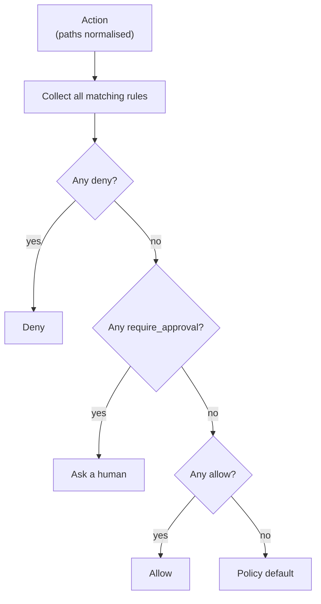

# Policies

A policy is a TOML file in the policies directory. Sessions choose one by name;
otherwise the agent's `policy`, otherwise `[policies].default`.

```toml
name = "default"
description = "Shown in the UI"
default = "require_approval"     # allow | deny | require_approval

[limits]
max_session_secs = 3600          # hard wall-clock limit, then the session is stopped
max_actions = 1000               # actions beyond this are denied
approval_timeout_secs = 900      # unanswered approvals are rejected
max_output_bytes = 65536         # tool output returned to the agent is truncated

[[rules]]
id = "approve-publish"           # unique, shown in the UI and the audit log
description = "Why this rule exists (shown to approvers and to the agent)"
effect = "require_approval"
kinds = ["exec"]                 # exec | file_read | file_write | network | tool_call
commands = ["git push*"]
```

## Matching

A rule matches an action when:

* `kinds` is empty or contains the action's kind, **and**
* every matcher the rule specifies matches the corresponding action field. A
  rule with `paths` never matches an `exec` action, for example.

| Matcher | Matched against | Glob notes |
|---|---|---|
| `commands` | full command line: `program arg1 arg2 …` | `*` matches anything, including `/` and spaces |
| `paths` | absolute, normalised path (`/workspace/src/main.rs`) | `*` stays within one path segment, `**` crosses segments |
| `hosts` | lower-cased host name, trailing dot removed | `*.example.com` |
| `tools` | tool name of `tool_call` actions | |

Relative paths are resolved against `/workspace`, and `..` is resolved
lexically before matching, so `../../etc/passwd` is checked as `/etc/passwd`.

## Evaluation: deny overrides



1. If any matching rule has `effect = "deny"`, the action is denied.
2. Otherwise, if any matching rule requires approval, a human must approve.
3. Otherwise, if any matching rule allows it, it is allowed.
4. Otherwise the policy `default` applies.

Rule order does not matter, so independent rules compose safely: adding an
`allow` rule can never override a `deny`.

## Testing a policy

```sh
agentcore policy check policies/
agentcore policy eval default '{"type":"file_read","path":"../.env"}'
```

Each session records the SHA-256 of the canonical policy (`policy_digest`), so
the audit log proves which exact policy governed the session.

## Bundled policies

| Policy | Purpose |
|---|---|
| `default` | Free inside `/workspace`, common dev tools allowed, publishing and unknown commands need approval, secrets and destructive commands denied. |
| `read-only` | Inspect only; any change is denied. |
| `supervised` | Every action needs approval (except secret access, which is denied). |
| `project-management` | For the project-manager role: read the repository, manage issues and the board; milestones and public posts need approval. |
| `marketing` | For the marketing role: write drafts under `/workspace/drafts/` only; public posts need approval. |
| `department` | Default for the workers of a [department](MULTI_AGENT.md): team messaging and department files allowed, inspection commands and workspace files allowed, everything else needs approval, secrets and destructive commands denied. Longer limits (8 h, 2000 actions) for long-lived agents. |
| `communicator` | For every communicator (`[org].communicator_policy`): only the messaging tools are allowed, everything else is denied. |

The default policy also allows reading GitHub (`github_list_*`, `github_get_*`,
`propose_pull_request`) and requires approval for GitHub writes. A role picks
its policy with `policy = "..."`; see [Ways of working](WAYS_OF_WORKING.md).

Department agents use tool calls named `team_list_colleagues`,
`team_read_messages`, `team_send_message`, `team_send_to_department`
(communicators only), `team_list_files`, `team_read_file`,
`team_write_file`, `team_list_goals` and `team_report_progress`, plus
`data_list_sources`, `data_query` and `insights_*` where the department was
granted business data or `insights`. `default` and `department` allow them
(reads, and proposals that change nothing until a person applies them). To have a person
approve messages that leave a department, give communicators a policy that
requires approval for `team_send_to_department`:

```toml
[[rules]]
id = "approve-outgoing"
description = "A person approves every message to another department."
effect = "require_approval"
kinds = ["tool_call"]
tools = ["team_send_to_department"]
```

## Caveats

Command matching is on the literal command line. `sh -c "<anything>"` is one
command, `sh`, and is therefore not allowed by `allow-dev-tools`; it falls to
the default (approval). Keep shells out of allow-lists. Policies govern
gateway actions; the sandbox is what contains everything else.
