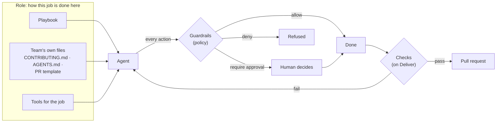
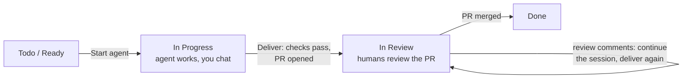
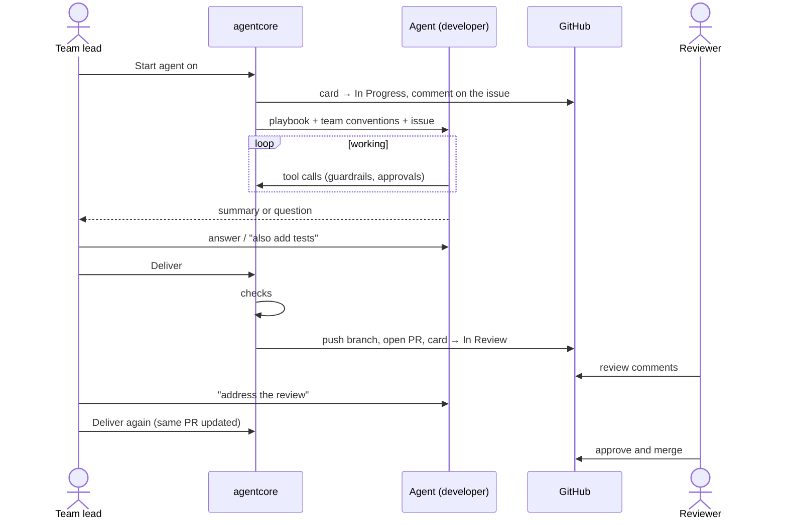

# Ways of working: guardrails, roles and checks

An agent that joins a team has to do two things: stay within what it is
*allowed* to do, and work the way *this team* works. agentcore keeps those
apart, because they are enforced differently:

| Layer | Question | Lives in | Enforced by |
|---|---|---|---|
| **Guardrails** | What may the agent do at all? | `policies/*.toml` | agentcore, on every action, before it runs |
| **Role** (playbook) | How does someone in this job work here? Which tools does the job need? | `roles/*.toml` + the team's own files in the repository | Instructions given to the agent; tools it is (not) given |
| **Checks** | Did the work follow the conventions? | `[[checks]]` in the role | agentcore, before work leaves the sandbox |



Instructions are advice; checks are proof. A model can ignore "use
Conventional Commits", but it cannot deliver a pull request whose commits
don't match the pattern.

## The team's own conventions come first

Most teams already wrote down how they work: `CONTRIBUTING.md`, `AGENTS.md`,
a pull request template, `.editorconfig`, a commitlint config, a brand voice
document. A role lists those files (`repo_docs`). When an agent starts,
agentcore reads whichever exist in the repository (inside the sandbox) and
gives them to the agent verbatim, ahead of the generic playbook, with the rule
that the team's files win. Changing how agents work is then mostly a pull
request to your own docs, the same change your human colleagues read.

What is not written down goes into the role's `instructions`, or into the
project's **notes** in the UI ("release freeze on Fridays", "ask Maria about
scope").

## Anatomy of a role

```toml
name = "developer"
title = "Software developer"
description = "Implements issues and proposes a pull request for human review."
policy = "default"                       # guardrails for this job

# GitHub tools this job gets (everything else is not offered to the agent)
capabilities = ["issues:read", "issues:comment", "milestones:read",
                "board:read", "discussions:read", "pull_requests:propose"]

# The team's own conventions, loaded when present
repo_docs = ["AGENTS.md", "CONTRIBUTING.md", ".github/pull_request_template.md"]

instructions = """
How someone in this role works on this team ...
"""

[workflow]                               # kanban
on_start = "in_progress"                 # card moves here when an agent starts
on_deliver = "in_review"                 # ... and here when work is delivered
announce_on_issue = true                 # comment on the issue at both points

[delivery]
kind = "pull_request"                    # or "none" (reports, GitHub updates)
branch = "agent/{issue}-{slug}"
draft = true

[[checks]]
name = "Commit messages follow the convention"
kind = "commit_message"
pattern = '^(feat|fix|docs|refactor|test|chore)(\([^)]+\))?!?: .{1,72}$'

[[checks]]
name = "All changes are committed"
kind = "clean_worktree"

[[checks]]
name = "Tests pass"
kind = "command"
run = "cargo test --quiet"
when_exists = "Cargo.toml"               # skipped in repositories without it
optional = false                         # optional checks report but don't block
```

### Capabilities and tools

| Capability | Tools the agent gets |
|---|---|
| `issues:read` | `github_list_issues`, `github_get_issue` |
| `issues:comment` | `github_comment_on_issue` |
| `issues:write` | `github_create_issue`, `github_update_issue` |
| `milestones:read` / `milestones:write` | `github_list_milestones` / `github_create_milestone`, `github_update_milestone` |
| `board:read` / `board:write` | `github_list_board_items` (columns, sprint) / `github_set_board_status` |
| `discussions:read` / `discussions:write` | `github_list_discussions`, `github_get_discussion` / `github_comment_on_discussion` |
| `pull_requests:propose` | `propose_pull_request` |

Tools only ever act on the project's own repository and board. Every call
is still checked by the guardrail policy (e.g. the default policy lets a
developer read freely but asks a human before commenting on GitHub) and
lands in the audit log. Anything an agent publishes carries an "AI agent"
footer.

### Bundled roles

| Role | Does | Guardrails | Delivers |
|---|---|---|---|
| `developer` | Implements issues: code, tests, commits | `default`: free in the workspace, approval for publishing and GitHub writes | Pull request (draft) |
| `project-manager` | Triages and grooms issues, plans milestones and sprints, moves cards | `project-management`: manages issues/board; milestones and public posts need approval | Changes on GitHub + a summary |
| `marketing` | Release notes, announcements, community replies | `marketing`: writes drafts only under `/workspace/drafts/`; public posts need approval | Draft files + (approved) discussion replies |

Copy one to start your own (`roles/qa.toml`, `roles/tech-writer.toml`,
`roles/support.toml`, ...). Roles are reviewed and versioned like code, and
every session records the role's SHA-256 so it is provable which playbook an
agent followed.

## How it fits the team's workflow





1. **Plan as usual.** Issues, milestones and the GitHub Projects board stay the
   source of truth. Sprints are the board's iteration field; agentcore shows
   the current one.
2. **Assign work to an agent.** On the project's board in agentcore, *Start
   agent* on a card (or ask the project-manager role to groom the backlog).
   The card moves to *In Progress* and the issue gets a comment saying an AI
   agent is on it and who supervises it.
3. **The agent works in a sandboxed checkout**, with the playbook, the team's
   conventions, the issue and its discussion. Risky actions wait for approval.
4. **Talk to it.** When it finishes a turn it waits. Answer its questions,
   correct the course or ask for more ("also add tests"); it continues in the
   same workspace and conversation.
5. **Review.** The *Changes* tab shows commits and the diff.
6. **Deliver.** agentcore runs the role's checks; if they pass it pushes the
   agent's branch, opens or updates the pull request (with the issue link and
   an AI disclosure), and moves the card to *In Review*. If they fail, tell the
   agent what to fix and deliver again.
7. **Code review happens on GitHub**, like for anyone else. To address review
   comments, continue the session and deliver again: the same pull request is
   updated.

## When to change what

| You want the agent to... | Change |
|---|---|
| never touch secrets / never run `sudo` | guardrail policy (`deny`) |
| ask before pushing or commenting | guardrail policy (`require_approval`) |
| write commits the team's way | the team's `CONTRIBUTING.md` + a `commit_message` check |
| format code / pass tests before review | `command` checks |
| know an unwritten rule of one project | project notes |
| behave like a PM instead of a developer | choose another role |
| get a new GitHub ability | role `capabilities` (+ policy rule for the new tools) |
